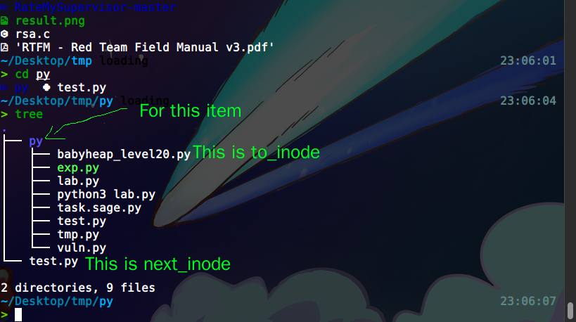

# LoOS filesystem: from raw.img to I/O syscalls

junyu33

2024/07/04

---

## overall procedure

- `disk_init`: 
    - read the `raw.img` using AHCI protocol
    - determine the number of sectors
    - save the whole content of raw.img into `ramdisk`.
- `fs_init`: 
    - set `stdin`, `stdout` and `stderr`
    - initialize other `fd` struct
    - traverse the whole filesystem save the information in global vars like `offset_by_inode`, `size_by_inode`, etc. 
- implementations of different I/O syscalls

---

## disk_init (`disk.c`: 20-40)

read the first sector of `raw.img` using AHCI protocol, the size is 512 bytes:

```c
    uint8_t buf[8192];
    HBA_MEM *abar = (void*)SATA_ADDR;
    int port_num = ahic_probe_port(abar);  // port 1, disk hdb
    // int ahci_read(HBA_MEM *abar, int port_num, uint32_t startl, uint32_t starth, uint32_t count, uint8_t *buf);
    ahci_read(abar, port_num, 0, 0, 1, buf);
```

> and here is a typo

then determine the number of sectors of `raw.img`:

```c
    struct fat32hdr *bs = (void*)buf;
    // we have these 2 entries in fat32.h, so we write this conditional operator
    // struct fat32hdr {
    // ...
    // uint16_t BPB_TotSec16;        // Total sectors (if zero, use BPB_TotSec32)
    // uint32_t BPB_TotSec32;        // Total sectors (if BPB_TotSec16 is 0, use this value)
    // ...
    // }
    int tot_sectors = bs->BPB_TotSec16 ? bs->BPB_TotSec16 : bs->BPB_TotSec32;
    Log("tot_sector: %d\n", tot_sectors);
```

---

finally, read the disk sectors sequentially, 4096 bytes each. And save them in `ramdisk`.

```c
    Log("CONFIG_RAMDISK_SIZE / 4096 = %d\n", CONFIG_RAMDISK_SIZE / 4096);
    for (int i = 0; i < min(tot_sectors / 8, CONFIG_RAMDISK_SIZE / 4096); i++) { // use min to avoid memory overflow
        int ret = ahci_read(abar, port_num, i*8, 0, 8, buf);
        memcpy(ramdisk + i*4096, buf, 4096); // copy to ramdisk
        if (ret == -1) {
            break;
        }
    }
```

and here is the two abstractions of ramdisk I/O (`disk.c`: 9-17):

```c
int ramdisk_read(void *buf, int offset, int len) {
    memcpy(buf, ramdisk + offset, len);
    return len;
}

int ramdisk_write(void *buf, int offset, int len) {
    memcpy(ramdisk + offset, buf, len);
    return len;
}
```

---

## fs_init (`fs.c`: 30-59)

set `stdin`, `stdout` and `stderr` file descriptors:

```c
    fds[STDIN].is_open = 1; // 标准输入
    fds[STDOUT].is_open = 1; // 标准输出
    fds[STDERR].is_open = 1; // 标准错误
```

add dirty hack to enable output written into the terminal, kind of like MMIO:

```c
    #define STDOUT_MAGIC_OFFSET 0xdeadbeef
    fds[STDOUT].offset = STDOUT_MAGIC_OFFSET;
    fds[STDERR].offset = STDOUT_MAGIC_OFFSET;
```

initialize other file descriptors:

```c
    for (int i = 3; i < MAX_FILES; i++) {
        fds[i].f_inode = NULL; // 文件 inode
        fds[i].offset = 0; // 文件偏移量
        fds[i].size = 0;   // 文件大小
        fds[i].base = 0;   // 文件在磁盘上的偏移量
        fds[i].is_open = 0; // 文件是否打开
    }
```

---

To get the inode for every file, LoOS traverses the FAT32 filesystem. First it needs to get the bootsector and the corresponding cluster:

```c
    // get the inode for every file
    struct fat32hdr* bootSector = (struct fat32hdr*)ramdisk;
    uint32_t cluster = bootSector->BPB_RootClus;    
    readDirectory(cluster, bootSector, 0);
```

Then it calls `readDirectory` (`fat32.c`: 245-340) to do the actual implementation.

```c
void readDirectory(uint32_t cluster, const struct fat32hdr *bootSector, int depth);
```

---

## readDirectory (`fat32.c`: 245-340)

If the currect cluster doesn't have an end-of-cluster marker `0xffffff8`, it reads the cluster and save the content in `buffer`

```c
    while (currentCluster < 0x0FFFFFF8) {
        readCluster(currentCluster, bootSector, buffer);
        struct DirectoryEntry *entries = (struct DirectoryEntry *)buffer;
        char lfn[256] = {0};
        int lfnIndex = 0;
```

For the procedure of readling a cluster, it can be summarized in 3 steps:

```c
void readCluster(uint32_t cluster, const struct fat32hdr *bootSector, uint8_t *buffer) {
    // Calculates the first sector of the data region.
    uint32_t firstDataSector = bootSector->BPB_RsvdSecCnt + (bootSector->BPB_NumFATs * bootSector->BPB_FATSz32);
    // Determines the first sector of the specified cluster within the data region.
    uint32_t firstSectorOfCluster = ((cluster - 2) * bootSector->BPB_SecPerClus) + firstDataSector;
    // Copies the entire cluster's worth of data from the ramdisk to the provided buffer.
    memcpy(buffer, ramdisk + (firstSectorOfCluster * bootSector->BPB_BytsPerSec),
        bootSector->BPB_BytsPerSec * bootSector->BPB_SecPerClus);
}
```

---

Then, we should process the directory entry:

```c
for (int i = 0; i < bootSector->BPB_BytsPerSec * bootSector->BPB_SecPerClus / sizeof(struct DirectoryEntry); i++) {
    if (entries[i].DIR_Name[0] == 0) {
        break;
    }
    if (entries[i].DIR_Name[0] == 0xE5) { // Deleted entry
        continue;
    }
    if ((entries[i].DIR_Attr & 0x0F) == 0x0F) { // Long file name entry
        parse_long_file_name(entries, i, lfn);
        continue;
    }
    if ((entries[i].DIR_Attr & 0x10) != 0) { // Directory
        // parse the directory
    } else {                                 // File
        // parse the file
    }
}
```

see section 6 in [this link](https://jyywiki.cn/pages/OS/manuals/MSFAT-spec.pdf) for more details.

---

Finally, handle directories...

```c
if (entries[i].DIR_Name[0] != '.' && entries[i].DIR_Name[1] != '.') { // assume no files begin with "./"
    if (lfn[0] != '\0') { // if lfn is not empty, we use the long filename
        memcpy(name_by_inode[inode_cnt], lfn, 256);
    } else {
        memcpy(name_by_inode[inode_cnt], entries[i].DIR_Name, 256);
    }
    offset_by_inode[inode_cnt] = get_offset(&entries[i], bootSector);
    ctime_by_inode[inode_cnt] = fat_to_unix_time(entries[i].DIR_CrtDate, entries[i].DIR_CrtTime);
    mtime_by_inode[inode_cnt] = fat_to_unix_time(entries[i].DIR_WrtDate, entries[i].DIR_WrtTime);
    atime_by_inode[inode_cnt] = fat_to_unix_time(entries[i].DIR_LstAccDate, 0); // 访问时间只有日期
    size_by_inode[inode_cnt++] = 0;

    int cur_inode = inode_cnt;
    uint32_t subdirCluster = (entries[i].DIR_FstClusHI << 16) | entries[i].DIR_FstClusLO;
    readDirectory(subdirCluster, bootSector, depth + 1); // recursive parse the content under that folder

    if (cur_inode == inode_cnt) { // empty folder
        to_inode[cur_inode - 1] = 0; 
    } else {
        // to_inode means the first file under the folder
        to_inode[cur_inode - 1] = cur_inode;                    
    }
    next_inode[cur_inode - 1] = inode_cnt; // next_inode means the next item after the folder (in the same depth)
}
```

--- 

For example:



--- 

and handle files:

```c
if (lfn[0] != '\0') {
    for (int j = 0; j < depth; j++) { printf("    "); } // for indentation
    memcpy(name_by_inode[inode_cnt], lfn, 256);
} else {
    printFileName(entries[i].DIR_Name, depth);
    memcpy(name_by_inode[inode_cnt], entries[i].DIR_Name, 256);
}
offset_by_inode[inode_cnt] = get_offset(&entries[i], bootSector);
ctime_by_inode[inode_cnt] = fat_to_unix_time(entries[i].DIR_CrtDate, entries[i].DIR_CrtTime);
mtime_by_inode[inode_cnt] = fat_to_unix_time(entries[i].DIR_WrtDate, entries[i].DIR_WrtTime);
atime_by_inode[inode_cnt] = fat_to_unix_time(entries[i].DIR_LstAccDate, 0); // 访问时间只有日期

size_by_inode[inode_cnt] = entries[i].DIR_FileSize;
to_inode[inode_cnt] = 0;
next_inode[inode_cnt] = inode_cnt + 1;
inode_cnt++;
```

In this way, we can store each file's metadata in global vars. However here are some drawbacks:

- A little tricky to append/delete new files/folders as well as maintaining `to_inode` and `next_inode`.
- Initialization time and memory overhead (not very important).

--- 

## Filesystem I/O syscalls implemetations

Here are the sources of I/O implementations in kernel-land. Some improvements are written in `TODO` in the comments of the code.

### open/openat

```c
int open(const char *pathname, int flags, ...) {
    if (pathname[0] == '.' && pathname[1] == '/') {
        pathname += 2; // TODO: we assume all files needed to open are in the root dir, TO BE FIXED!!!
    }
    for (int i = 3; i < MAX_FILES; i++) {
        if (!fds[i].is_open) {
            fds[i].is_open = 1;
            fds[i].base = find_offset_by_pathname(pathname);
            fds[i].offset = 0; // the inner offset from a file
            fds[i].size = find_size_by_pathname(pathname);
            if (fds[i].base < 0 || fds[i].size < 0) {
                fds[i].is_open = 0;
                return -1;
            }
            return i; // 返回文件描述符
        }
    }
    return -1; // 没有可用的文件描述符
}
```

--- 

```c
int openat(int dirfd, const char *pathname, int flags) {
    // ... (the same as open)
    if (fds[i].base < 0 || fds[i].size < 0) {
        if (flags & O_CREAT) {
            // 创建文件
            strcpy(name_by_inode[inode_cnt], pathname);
            offset_by_inode[inode_cnt] = 0; // TODO: change 0 to another reasonable value
            size_by_inode[inode_cnt] = 0;
            to_inode[inode_cnt] = -1; next_inode[inode_cnt] = to_inode[dirfd]; // link-list insertion
            to_inode[dirfd] = inode_cnt; inode_cnt++;

            for (int j = 3; j < MAX_FILES; j++) {
                if (!fds[j].is_open) {
                    fds[j].f_inode = inode_cnt - 1; // corresponding inode for current fd
                    fds[j].is_open = 1;
                    fds[j].base = 0x100000; // TODO: substitute 0x1000000 to another reasonable value
                    fds[j].offset = 0;
                    fds[j].size = 0;
                    return j; // 返回文件描述符
                }
            }
        }
        fds[i].is_open = 0;
        return -1;
    }
    // ... (the same as open) 
}
```

---

### close

```c
static inline int fd_invalid(int fd) {
    return (fd < 0) || (fd >= MAX_FILES) || (!fds[fd].is_open);
}

int close(int fd) {
    if (fd_invalid(fd)) {
        return -1;
    }

    // dirty hack
    if (fd > 2) {
        fds[fd].is_open = 0;
    }
    return 0;
}
```

--- 

### lseek

```c
int check_offset(FILE *f, int offset) {
    if (offset < 0) 
        return 0;
    else if (offset >= f->size) 
        return f->size;
    else 
        return offset;
}

int lseek(int fd, int offset, int whence) {
    if (fd_invalid(fd)) { return -1;}

    FILE *f = &fds[fd];
    switch (whence) {
        case SEEK_SET: f->offset = check_offset(f, offset); break;
        case SEEK_CUR: f->offset = check_offset(f, f->offset + offset); break;
        case SEEK_END: f->offset = check_offset(f, f->size + offset); break;
        default: return -1;
    }

    return f->offset;
}
```

---

### read/write

```c
size_t read(int fd, void *buf, size_t count) {
    if (fd_invalid(fd)) {
        return -1;
    }

    int remain = fds[fd].size - fds[fd].offset;
    int bytes_read = ramdisk_read(buf, fds[fd].base + fds[fd].offset, _min(count, remain));
    if (bytes_read > 0) {
        fds[fd].offset += bytes_read;
    }

    return bytes_read;
}
```

---

```c
size_t write(int fd, const void *buf, size_t count) {
    if (fd_invalid(fd)) {
        return -1;
    }

    // dirty hack of written to stdout and stderr
    if (fds[fd].offset == STDOUT_MAGIC_OFFSET) {
        for (int i = 0; i < count; i++) {
            putch(((char *)buf)[i]);
        }
        return count;
    }

    int remain = fds[fd].size - fds[fd].offset;
    int bytes_written = ramdisk_write((void *)buf, fds[fd].base + fds[fd].offset, _min(count, remain));
    if (bytes_written > 0) {
        fds[fd].offset += bytes_written;
        if (fds[fd].offset > fds[fd].size) {
            // TODO: add some checks if different fds overlap
            fds[fd].size = fds[fd].offset;
        }
    }

    return bytes_written;
}
```

--- 

### fstat

```c
int find_inode_by_base(int base) {
    for (int i = 0; i < inode_cnt; i++) {
        if (offset_by_inode[i] == base) {
            return i;
        }
    }
    return -1; // File not found
}
int fstat(int fd, struct stat* buf) {
    int offset = fds[fd].base;
    int size = fds[fd].size;
    buf->st_dev = 1792;         // MAGIC NUMBER
    buf->st_ino = find_inode_by_base(offset);         // Inode number 
    buf->st_mode = 33261;        // MAGIC NUMBER
    buf->st_nlink = 1;       // Number of hard links 
    buf->st_uid = 0;         // TODO: fix user id
    buf->st_gid = 0;         // TODO: fix group id 
    buf->st_rdev = 0;        // TODO: fix device id
    buf->st_size = size;     // Total size, in bytes
    buf->st_blksize = 512;   // Blocksize for file system I/O
    buf->st_blocks = (size + 511) / 512; // Number of 512B blocks allocated
    buf->st_atime = atime_by_inode[(uint32_t)buf->st_ino];   // Time of last access
    buf->st_mtime = mtime_by_inode[(uint32_t)buf->st_ino];   // Time of last modification
    buf->st_ctime = ctime_by_inode[(uint32_t)buf->st_ino];   // Time of last status change
    return 0;
}
```

---

### fcntl

```c
int fcntl(int fd, int cmd, ...) {
    if (fd_invalid(fd)) {
        return -1;
    }
    // dynamic argument
    va_list args;
    va_start(args, cmd);
    int result = -1;

    switch (cmd) {
        case F_DUPFD: { // copy a new fd to the current fd
            int arg = va_arg(args, int);
            for (int i = arg; i < MAX_FILES; i++) {
                if (!fds[i].is_open) {
                    fds[i] = fds[fd];
                    result = i;
                    break;
                }
            }
            break;
        }
        case F_GETFD: // get the status of current fd
            result = fds[fd].is_open;
            break;
    // to be continued ...
```

---

```c
        case F_SETFD: { // set the status of current fd
            int arg = va_arg(args, int);
            fds[fd].is_open = arg;
            result = 0;
            break;
        }
        // TODO: getting the file status flags.
        case F_GETFL: result = 0; break; 
        // TODO: setting the file status flags.
        case F_SETFL: result = 0; break; 
        // TODO: getting the record locking information.
        case F_GETLK: result = 0; break; 
        // TODO: record locking information (non-blocking).
        case F_SETLK: result = 0; break; 
        // TODO: record locking information (blocking).
        case F_SETLKW: result = 0; break; 
        default: result = -1; break;
    }

    va_end(args);
    return result;
}
```

--- 

### dup/dup3

```c
int dup(int oldfd) {
    for (int i = 3; i < MAX_FILES; i++) {
        if (!fds[i].is_open) {
            fds[i] = fds[oldfd];
            return i;
        }
    }
    return -1;
}
```

```c
int dup3(int oldfd, int newfd, int flags) {
    assert(newfd >= 3 && newfd < MAX_FILES);
    // TODO: 检查 oldfd 和 newfd 是否有效
    // if (fd_invalid(oldfd) || fd_invalid(newfd)) {
    //     // errno = EBADF;
    //     return -1;
    // }

    // 如果 oldfd 和 newfd 相同，且没有其他标志，则直接返回 newfd
    if (oldfd == newfd) {
        return newfd;
    }
    // (to be continued)
```

---

```c
    // 如果 newfd 已经打开，先关闭它
    if (fds[newfd].is_open == 1) {
        close(newfd);
    }

    // 复制 oldfd 的文件描述符到 newfd
    fds[newfd] = fds[oldfd];

    // 处理 flags
    if (flags & O_CLOEXEC) {
        // 设置 O_CLOEXEC 标志
        int flags_newfd = fcntl(newfd, F_GETFD);
        if (flags_newfd == -1) {
            return -1;
        }
        if (fcntl(newfd, F_SETFD, flags_newfd | FD_CLOEXEC) == -1) {
            return -1;
        }
    }

    // 返回新的文件描述符
    return newfd;
}
```

---

### getdents64

```c
int getdents64(int fd, struct linux_dirent64 *dirp, size_t count) {
    int bytes_written = 0;
    int cur_inode = find_curnode_byfd(fd);  
    if (cur_inode < 0 || cur_inode >= inode_cnt) {
        return -1; // Invalid inode index
    }
    int child_inode = to_inode[cur_inode]; // to_inode is the first child node
    while (child_inode != -1 && bytes_written < count) {
        struct linux_dirent64 *current_dirent = (struct linux_dirent64 *)((char *)dirp + bytes_written);
        size_t name_len = strlen(name_by_inode[child_inode]);
        size_t record_length = offsetof(struct linux_dirent64, d_name) + name_len + 1;
        if (bytes_written + record_length > count) { break; } // Not enough space left in buffer
        current_dirent->d_ino = child_inode;
        current_dirent->d_off = bytes_written + record_length;
        current_dirent->d_reclen = record_length;
        // Assuming regular file type for simplicity (file or dir)
        current_dirent->d_type = size_by_inode[current_dirent->d_ino] ? DT_REG : DT_DIR; 
        strcpy(current_dirent->d_name, name_by_inode[child_inode]);

        bytes_written += record_length;
        child_inode = next_inode[child_inode]; // go to the next node in the same depth
    }
    return bytes_written;
}
```

--- 

### mkdir

```c
int mkdir(int dirfd, const char *pathname, int mode) {
    int new_inode = find_inode_by_pathname(pathname);
    if (new_inode != -1) {
        return -17; // Directory already exists, you can see errno.h to check this err code
    }

    // Create a new directory
    strcpy(name_by_inode[inode_cnt], pathname);
    offset_by_inode[inode_cnt] = -1;
    size_by_inode[inode_cnt] = 0;
    to_inode[inode_cnt] = -1;
    // TODO: there is no data structure connected to this new dir, please add it!!!
    inode_cnt++;

    return 0;
}
```

---

### unlinkat

WARNING: this implementation is wholly TESTCASE ORIENTED (because the testcase delete the new dir just after `mkdir` it). **So please rewrite this implementation!!!**

```c
// TODO: rewrite this function
int unlinkat(int dirfd, const char *pathname, int flags) {
    if (pathname[0] == '.') {
        pathname += 2;
    }

    for (int i = 0; i < inode_cnt; i++) {
        if (strcmp(name_by_inode[i], pathname) == 0) {
            inode_cnt--;
            return 0;
        }
    }

    return -1; // Directory not found
}
```
