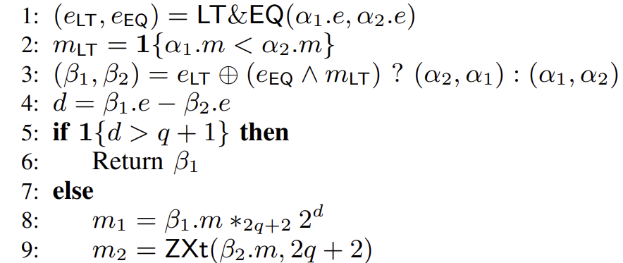
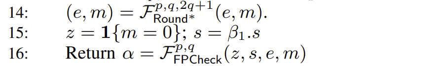
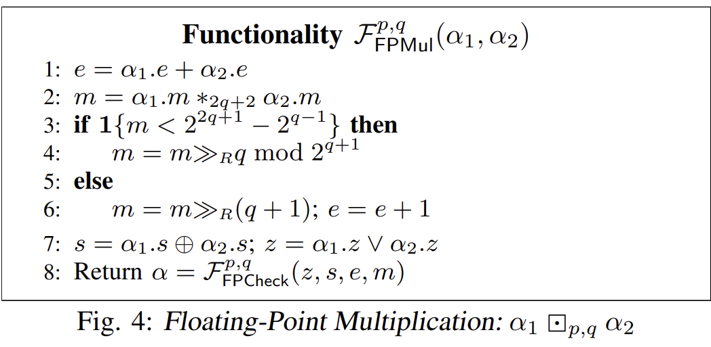
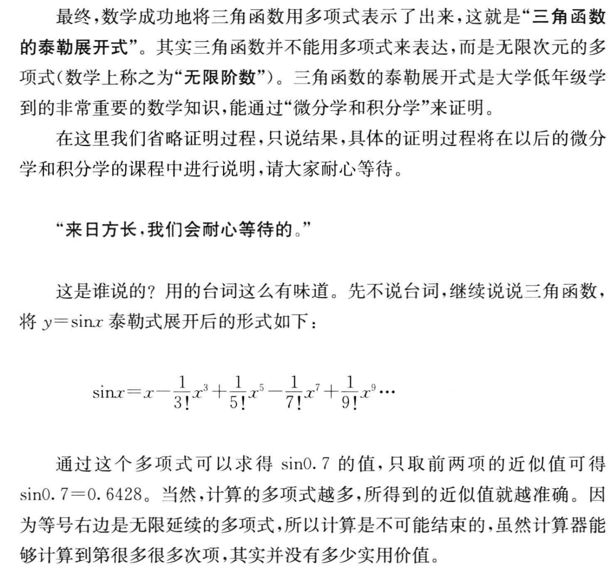
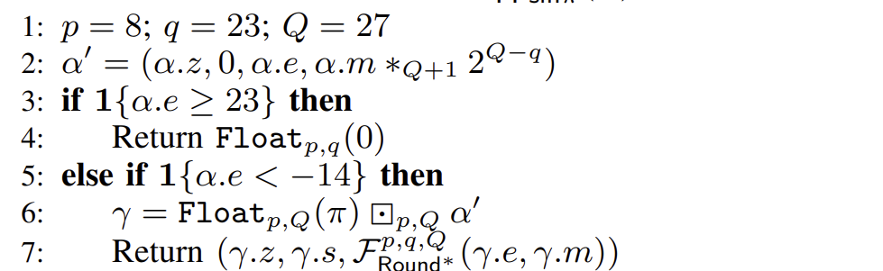

# SecFloat: Accurate Floating-Point meets Secure 2-Party Computation

---

## Background

Notation: 记安全参数为 $\lambda$, 秘密共享的整数长度为 $l$-bit.

<v-click>

MPC方面，假设我们拥有以下基础知识：

- 可以使用基于公钥密码等方式实现 1-out-of-$k$ $\text{OT}_l$，单次通信量 $2\lambda+kl$，使用 IKNP 可以做到 $\lambda+kl$。
- 基于 2-party 的加法 secret sharing 的加法与标量乘几乎免费（无通信开销）。
- 可以使用 beaver triple 实现 2-party 的安全乘法操作。一次安全乘法，总通信量为 $2l$。

</v-click>

<v-click>

在浮点数储存方面，我们使用 IEEE754 Float32（单精度标准）：

- $(-1)^S \times (1.M) \times 2^{E-bias}$
- 符号位 $S$ 1位、指数为 $E$ 7 位、尾数 $M$ 为 23 位、$bias=127$
- 四舍六入五成双（round-to-nearest-ties-to-even）

</v-click>


--- 

### IEEE 754 加法

不失一般性，设 $x \ge y$，为了计算 $z=x+y$，其中：
 
$$x=(-1)^{S_x} \cdot (1.M_x) \cdot 2^{E_x},\quad y=(-1)^{S_y} \cdot (1.M_y) \cdot 2^{E_y}$$

则步骤如下：

<v-click>

1. 指数对齐。若 $E_x$ > $E_y$，将 $y$ 的尾数右移： $M_y \leftarrow \frac{1.M_y}{2^{E_x-E_y}}, \quad E \leftarrow E_x, \quad M_x \leftarrow (1.M_x)$.

</v-click>

<v-click>

2. 尾数相加。考虑$S_x, S_y$的符号情况。若同号，则计算 $M=M_x+M_y$。若异号，则用大者减小者得到差的绝对值$M=|M_x-M_y|$，并附上正确的符号$S$。

</v-click>

<v-click>

3. 规范化。显然 $\max\{M_x+M_y, |M_x-M_y|\}<4$，故$M$右移最多只需一次（对应指数$E$加1即可）。若 $M=0$，则直接跳到第四步。其余情况反复左移并自减$E$，直到$M \in [1, 2)$ 时停止。

</v-click>

<v-click>

4. 写入结果。最后将 $M$ 的首位 1 剔除，将最后的 $S, E, M$ 重新作为新的 32 位浮点结果。

</v-click>

<v-click>

5. 在 $M_y \leftarrow \frac{1.M_y}{2^{E_x-E_y}}$、$M=M_x+M_y$、$M=|M_x-M_y|$以及对$M$右移一位这四个步骤中，会涉及到舍入问题。

</v-click>

---

### IEEE 754 乘法

乘法由于不涉及数的大小比较，因此步骤相对比较简单。

<v-click>

1. 符号位异或。$S = S_x \oplus S_y$.

</v-click>

<v-click>

2. 指数相加。$E = E_x + E_y - bias$.

</v-click>

<v-click>

3. 尾数相乘。$M=(1.M_x) \cdot (1.M_y)$，结果在 $[1, 4)$ 范围内。

</v-click>

<v-click>

4. 规范化。如果结果 $\ge 2$，将 $E$ 自增并将 $M$ 右移一位，最后剔除 $M$ 最高位的 1.

</v-click>

<v-click>

5. 在 $M=(1.M_x) \cdot (1.M_y)$ 与 $M$ 右移一位这两步涉及到舍入操作。

</v-click>

<v-click>

### 舍入方法

我们令 $d,g,f$ 分别为 $M$ 的最低位（decision bit），被丢弃的最高位（guard bit）和被丢弃的剩余位（sticky bit）。则“四舍六入五成双”的规则可以形式化表述为如下公式：

$$ c = g \land (d \lor f) $$

简单的解释一下，就是只有当 $g=1$ 时才可能进位。此时如果 $f=1$（肯定大于0.5）或者 $d=1$（刚好$0.5$但要是偶数），则进位（$c=1$）。

注意舍入之后有可能需要再次规范化。

</v-click>

---

## Building Blocks

下面用自底向上的方式，讲清楚整个协议是如何构建的。

### $\mathcal{F}_{MUX}$

我们需要实现的理想功能是，`MUX(b,x)=(b==1?x:0)`。即对于布尔 secret share $[c]=(c_0, c_1), c_i \in \{0,1\}$ 和算术 secret share $[a]=(a_0,a_1), a \in Z_n$，输出 $[a \cdot c]$。步骤如下：

<v-click>

SETUP: $P_0$ 持有 $a_0,c_0$，$P_1$ 持有 $a_1,c_1$。

</v-click>

<v-click>

- $P_0$ 与 $P_1$ 各自生成随机数 $r_0, r_1 \in Z_n$。

</v-click>

<v-click>

- $P_0$ 根据 $c_0$ 的值设置 $(s_0, s_1)$。若 $c_0=0$，令 $(s_0,s_1)=(-r_0,-r_0+a_0)$，否则为 $(-r_0+a_0,-r_0)$。

</v-click>

<v-click>

- $P_0$ 作为发送方与 $P_1$ 做一轮 1-out-of-2 OT，$P_0$ 提供两条消息 $(s_0, s_1)$，$P_1$ 提供 $c_1$ 并最终获得 $x_1=s_{c_1}$。

</v-click>

<v-click>

- $P_1$ 根据 $c_1$ 的值设置 $(t_0, t_1)$。若 $c_1=0$，令 $(t_0,t_1)=(-r_1,-r_1+a_1)$，否则为 $(-r_1+a_1,-r_1)$。

</v-click>

<v-click>

- 再做一轮 OT，$P_0$ 获得 $x_0=t_{c_0}$。

</v-click>

<v-click>

- $P_0$ 贡献 $r_0+x_0$，$P_1$ 贡献 $r_1+x_1$。加起来是 $(r_0+r_1)+(x_0+x_1)$。

</v-click>

---

我们列举出四种可能的 $(c_0, c_1)$ 情况：

> $(s_0,s_1)=(-r_0+c_0a_0,-r_0+a_0(1-c_0))$，$(t_0,t_1)=(-r_1+c_1a_1,-r_1+a_1(1-c_1))$
>
> $x_0=t_{c_0}, x_1=s_{c_1}$

<v-click>

|  $c_0$ |  $c_1$  |  $x_0$  |  $x_1$  |  $(r_0+r_1)+(x_0+x_1)$  |
|:----:|:----:|:----:|:----:|:----:|
|  0 |  0 |  $-r_1+c_1a_1$ |  $-r_0+c_0a_0$ |  0 |
|  0 |  1 |  $-r_1+c_1a_1$ |  $-r_0+a_0(1-c_0)$ |  $a$ |
|  1 |  0 |  $-r_1+a_1(1-c_1)$ |  $-r_0+c_0a_0$ |  $a$ |
|  1 |  1 |  $-r_1+a_1(1-c_1)$ |  $-r_0+a_0(1-c_0)$ |  0 |

结果刚好等于 $[a\cdot c]$，因此协议正确。

</v-click>

<v-click>

通信量为两轮 IKNP-OT 的开销，也就是 $2(\lambda+2l)=2\lambda+4l$。但 CryptoFlow2 的 3.1.1 节可以将通信开销优化到 $2\lambda+2l$。

</v-click>

---

### $\mathcal{F}_{AND}$

这是显然的，直接使用 beaver triple 实现，通信量为 $(\lambda+16)+4$。（见 CryptoFlow2 的附录 A1 节）

<v-click>

### $\mathcal{F}_{OR}$

我们有 $[x \lor y]=[x \oplus y] \oplus [x \land y]$。因此令 $[x \land y]=(z_0,z_1)$，因此每一方直接计算 $x_i \oplus y_i \oplus z_i$ 即可。通信量与 $\mathcal{F}_{AND}$ 相同，也为 $\lambda+20$。

</v-click>

<v-click>

### $\mathcal{F}_{EQ}$

我们将 $x,y$ 按照 $m$-bit 进行分块。考虑对某个块 $x_j, y_j$ 进行比较。我们使用 1-out-of-$2^m$ OT：

- $P_0$ 随机选取 $(eq_{0,j})_0$，并对 $k \in [0, 2^m-1]$ 准备消息 $t_{j,k}=(eq_{0,j})_0 \oplus (x_j == k)$.
- $P_0$ 将 $2^m$ 个消息作为 OT 的输入，$P_1$ 输入 $y_j$，并获得 $(eq_{0,j})_1$.
- 当且仅当 $x_j=y_j$ 时，我们有 $(eq_{0,j})_0 \oplus (eq_{0,j})_1=1$，这就完成了 $x_j, y_j$ 的秘密EQ判断。

我们可以通过树状结构与 $\mathcal{F}_{AND}$，计算 $(eq_{1,j})_i = (eq_{0,j})_i \land (eq_{0,j+m})_i$，将 $m$-bit 比较拓展到 $2m$-bit，最后完成整个长度的比较。通信量为 $\lceil \frac{l}{m} \rceil (2\lambda+2^m)+\lceil \frac{l}{m} \rceil(\lambda+20)$，轮数为 $\log l$.

</v-click>

---

### $\mathcal{F}_{GT/LT}$

仍然是分块的思路，首先计算块长度为 $m$ 的结果 $1\{x_j < y_j\}$，还是可以使用 1-out-of-$2^m$ OT 完成。$P_0$ 只需随机生成 $(lt_{0,j})_0$, 并准备 $2^m$ 个消息 $t_{j,k}=(lt_{0,j})_0 \oplus 1\{x_j < k\}$.

<v-click>

然后合并的时候高位优先，$1\{x<y\}=1\{x_H<y_H\} \oplus (1\{x_H=y_H\} \land 1\{x_L<y_L\})$.

通信成本小于 $\lambda(4q) + 2^m(2q) + 22q$，取 $m=4, q=l/4$ 时为 $\lambda l+13.5l$ ，轮数 $\log l$.

</v-click>

<v-click>

### $\mathcal{F}_{LUT}$

假设 LUT 有 $2^m$ 项，每一项有 $n$-bit.

SETUP: $P_0$ 随机取索引 $r \in \{0,1\}^m$，和 LUT $L$ 混淆后的 share $T^0[i] \in Z_{2^n}, \quad \forall i \in \{0,1\}^m$.

</v-click>

<v-click>

- $P_0$ 对每个 $s \in \{0,1\}^m$，构造 $M_s[i] = L[i \oplus r \oplus s] \oplus T^0[i], \quad \forall i \in \{0,1\}^m$.

</v-click>

<v-click>

- $P_0$ 将这 $2^m$ 条长度为 $n$-bit 的消息与 $P_1$（选取 $s$）作 1-out-of-$2^m$ $\text{OT}_n$，成本为 $2\lambda+2^mn$. 

</v-click>

<v-click>

- $P_1$ 令 $T^1 \leftarrow M_s$。现在 $P_0$ 持有 $(T^0, r)$，$P_1$ 持有 $(T^1, s)$.

</v-click>

<v-click>

- 在线阶段，$P_0$ 发送 $u = x_0 \oplus r$, $P_1$ 发送 $v = x_1 \oplus s$，双方同时计算 $i^*=u \oplus v=x \oplus r \oplus s$. 最后 $P_0, P_1$ 分别保存 $T^0[i^*], T^1[i^*]$，显然合起来是 $L[x]$。通信成本 $2m$ 可忽略。

</v-click>

---

### $\mathcal{F}_{Wrap}$

如果我们要计算 $1\{a+b>2^n-1\}$，这等同于计算 $1\{2^n-1-a<b\}$。因此直接使用 $\mathcal{F}_{GT/LT}$ 即可。

<v-click>

### $\mathcal{F}_{B2A}$

$P_0, P_1$ 分别持有布尔共享的一位 $c = c_0 \oplus c_1, c \in \{0,1\}$，并最后得到 $d=d_0+d_1 \pmod{2^n}$ 且 $d=c$。 

</v-click>

<v-click>

- $P_0$ 随机选取 $x \in Z_{2^n}$，生成二元组 $(x, c_0+x)$， 并与 $P_1$ （持有输入 $c_1$）执行 1-out-of-2 $\text{COT}_n$，$P_1$ 拿到结果 $y_1$。$P_0$ 设置 $y_0=2^n-x$.

</v-click>

<v-click>

- 双方本地线性修正，$P_0$ 计算 $d_0=c_0-2y_0$，$P_1$ 计算 $d_1=c_1-2y_1$.

</v-click>

<v-click>

验证一下结果，$d_0+d_1=c_0+c_1-2(y_0+y_1)$。

- 当 $c_1=0$ 时，$y_0+y_1=(2^n-x)+x=2^n$，故 $d_0+d_1=c_0+c_1 \pmod{2^n}$。
- 当 $c_1=1$ 时，$y_0+y_1=(2^n-x)+(c_0+x)=2^n+c_0$，故 $d_0+d_1=c_0+c_1-2c_0=1-c_0$. 但此时 $c=c_0 \oplus 1 = 1 - c_0$，因此 $d=c$ 仍然成立。

通信开销为一次 1-out-of-2 $\text{COT}_n$，成本为 $\lambda+n$.

</v-click>

---

### $\mathcal{F}_{ZExt}$

我们有了前面的 $\mathcal{F}_{Wrap}$ 和 $\mathcal{F}_{B2A}$，构造 $\mathcal{F}_{ZExt}$ 便是自然的事情。对于 $m$-bit 的加法共享，我们尝试将其零扩展到 $n$-bit $(n>m)$。首先，我们要 check 这两个 share 是否有进位（使用 $\mathcal{F}_{Wrap}$），然后将得到的布尔进位 $w$ 使用 $\mathcal{F}_{B2A}$ 转为 $Z_{2^{n-m}}$ 的算术值。

<v-click>

但我们只是做零扩展操作，两个 share 相加，不能在第 $m$ 位产生进位，因此双方要在 $Z_{2^n}$ 减掉一个 $2^m$ 的 share，由于 $m$ 公开，可以直接本地完成。

成本为 $\text{Comm}(\mathcal{F}_{Wrap}+\mathcal{F}_{B2A})=\lambda m+14m+\lambda+(n-m)=\lambda(m+1)+13m+n$.

</v-click>

<v-click>

### $\mathcal{F}_{TR}$

既然我们有了从小到大的 $\mathcal{F}_{ZExt}$，那自然也有反过来的 $\mathcal{F}_{TR}$。我们假设从 $l$-bit 截断低位的 $s$-bit，并输出最终的高位 $l-s$-bit（这本质上也等同于 `x >> s`）：

SETUP: $P_b$ 将原来的 share $x_b$ 拆成 $u_b||v_b$，前者为 $l-s$ 位，后者为 $s$ 位，可以证明：

$$ TR(x, s) = u_0+u_1+Wrap(v_0,v_1,s) $$

开销为 $\text{Comm}(\mathcal{F}_{Wrap}+\mathcal{F}_{B2A})=(\lambda s + 14s) + (\lambda + (l - s)) = \lambda(s+1) + 13s + l$.

</v-click>

---

### $\mathcal{F}_{CrossTerm}$

$\mathcal{F}_{CrossTerm}$ 与用 beaver triple 的安全乘法比较相近，但区别是后者 $P_0$ 和 $P_1$ 都知道 $x$ 和 $y$ 的一部分 share。而 $\mathcal{F}_{CrossTerm}$ 的适用条件是 $P_0$ 独占 $x$，$P_1$ 独占 $y$，最后各自获得长度 $l=m+n$ 的 $x*y$ 的 share. 

<v-click>

- $P_0$ 将自己的 $x$ 写成二进制 $x=\sum_{i=0}^{m-1} x_i 2^i, \quad x_i \in \{0, 1\}$.

</v-click>

<v-click>

- 对 $i \in [0, m-1]$, 调用 1-out-of-2 $\text{COT}_{l-i}$：$P_0$ 持有 $x_i$，$P_1$ 持有 $y$，生成 $⟨t_i⟩^{l-i}$ 满足 $t_i=x_i \cdot y$.

</v-click>

<v-click>

- 双方本地计算 $⟨z⟩^l=\sum_{i=0}^{m-1} ⟨t_i⟩^{l-i}$，显然两个share加起来就是乘积$x \cdot y$.

</v-click>

<v-click>

总通信成本为 $\sum_{i=0}^{m-1} (\lambda + (l - i))=m\lambda+ml-\frac{m(m-1)}{2}=O(m\lambda+mn)$.

</v-click>

<v-click>

### $\mathcal{F}_{UMult}$

语义是双方持有 $x = x_0 + x_1 \pmod{2^m}, \quad y = y_0 + y_1 \pmod{2^n}$，目标是计算 $z = x \cdot y \in Z_{2^{m+n}}$.

这里还是不能直接做 beaver triple，因为它是 ring agnostic 的，可能会带来未知的 wrap 问题。当然一个办法是将 $x,y$ 都扩展到足够大的环，做安全乘法后又截断回去。当然这里有两个问题，一是 $\mathcal{F}_{TR}$ 是高位截断而不是低位截断，协议需要稍微改一改；二是这种办法运算成本较高，不如接下来介绍的专用 $\mathcal{F}_{UMult}$ 协议。

</v-click>

---

我们现在要计算$(x_0+x_1)(y_0+y_1)=x_0y_0+x_1y_1+x_0y_1+x_1y_0$，前两者可以分别由 $P_0,P_1$ 离线完成。而后两者就涉及到刚才的 $\mathcal{F}_{CrossTerm}$ 了。总之，我们有了在 $P_0$ 存储的完整 $x_0y_0$，$P_1$ 存储的 $x_1y_1$，以及双方都拥有的 $⟨x_0y_1⟩, ⟨x_1y_0⟩$ 的一部分。$\mathcal{F}_{UMult}$ 的作用就是把这 4 项安全地拼起来，并且处理 wrap 的问题。

<v-click>

- 首先，我们要考虑 $x_0+x_1, y_0+y_1$ 是否溢出的问题，因此需要 $\mathcal{F}_{Wrap}$ 进行检测得到两个溢出位 $w_x, w_y$。

</v-click>

<v-click>

- 然后我们可以利用 $\mathcal{F}_{MUX}$ 计算 `g=w_y?x:0` 与 `h=w_x:y:0`的 share $⟨g⟩,⟨h⟩$，处理可能的溢出差值。

</v-click>

<v-click>

- 最终 $P_b$ 输出 $x_by_b+⟨x_0y_1⟩_b+⟨x_1y_0⟩_b-2^n⟨g⟩_b-2^m⟨h⟩_b$.

</v-click>

<v-click>

尝试把两个 share 加起来看看：$\sum_b (x_by_b+⟨x_0y_1⟩_b+⟨x_1y_0⟩)=(x_0+x_1)(y_0+y_1)$

而 $\sum_b (-2^n⟨g⟩_b-2^m⟨h⟩_b)=-2^ng-2^mh=-2^n(w_y\cdot x)-2^m(w_x\cdot y)$

</v-click>

<v-click>

合在一起，$z=(x_0+x_1)(y_0+y_1)-w_y\cdot(x\cdot 2^n)-w_x\cdot(y\cdot 2^m)$

$=(x+w_x2^m)(y+w_y2^n)-w_y\cdot(x\cdot 2^n)-w_x\cdot(y\cdot 2^m)=xy$，刚好抵消。

</v-click>

<v-click>

设$\nu=\max(m,n),l=m+n$，论文给出了具体的开销，数量级为 $O(\lambda \nu + \nu^2)$。相比于 beaver triple 做法（含生成乘法三元组）的 $O(\lambda l+l^2)$ 数量级相同，但论文声称 $\mathcal{F}_{UMult}$ 通信少 $1.5 \times$. 

$\mathcal{F}_{SMult}$ 与 $\mathcal{F}_{UMult}$ 原理类似，通信量完全相同，这里就略过了。

</v-click>

---

### $\mathcal{F}_{DigDec}$

作用是将一个 $l$-bit 的 share $⟨x⟩$，按 $d$-bit 分块，拆分成 $c = \lceil \frac{l}{d} \rceil$ 个 $\{⟨z_i⟩\}_{i=0}^{c-1}$，其中 $x=z_{c-1}||z_{c-2}|| \cdots || z_0$. 显然，本地进行这个操作会导致 wrap 问题。

<v-click>

当然解决这个问题的思路也容易想到，首先使用 $\mathcal{F}_{wrap}$ 判断 $⟨x_{[0,d-1]}⟩$ 的两个 share 是否溢出，并得到溢出结果的 share $⟨c_0⟩$，令 $⟨z_0⟩=⟨x_{[0,d-1]}⟩-2^d⟨c_0⟩$，并将目前双方的高位 $⟨x_{[d,l-1]}⟩$ 加上 $⟨c_0⟩$，最后递归执行这一过程即可。

</v-click>

<v-click>

复杂度相当于 $(c-1)$ 次 $\mathcal{F}_{wrap}$ 的成本，也就是 $(c-1)(\lambda d + 14d)$.

</v-click>

<v-click>

### $\mathcal{F}_{MSNZB-P}$

检测第 $i$ 个 $d$-bit 分块中最高非零位对应的全局 index，也可以理解成 $\lfloor \log_2(z_i) \rfloor + i \cdot d$，这里的具体实现方法是直接 $\mathcal{F}_{LUT}$ 解决。但有一个问题是当 $z_i=0$ 时右边这个式子与左边实现的语义并不相同，作者这里选择让 $z_i=0$ 的结果未定义，交给上层协议来解决。

> 这一点我不是很理解，$z_i=0$ 的情况也可以在 $\mathcal{F}_{LUT}$ 的情况直接解决啊，又不会增加通信成本。

总之，通信量等价于一个 1-out-of-$2^d$ $\text{OT}_{\lceil \log_2 l \rceil}$ 实现，因此通信量为 $2\lambda + 2^d \lceil \log_2 l \rceil$.

</v-click>

<!-- 检测第 $i$ 个 $d$-bit 分块中最高非零位对应的全局 index，也可以理解成 $\lfloor \log_2(z_i) \rfloor + i \cdot d$，这里的具体实现方法是直接 $\mathcal{F}_{LUT}$ 解决。但有一个问题是当 $z_i=0$ 时右边这个式子与左边实现的语义并不相同，作者这里选择让 $z_i=0$ 的结果未定义，交给上层协议来解决。（这一点我不是很理解，$z_i=0$ 的情况也可以在 $\mathcal{F}_{LUT}$ 的情况直接解决啊，又不会增加通信成本。）

总之，通信量等价于一个 1-out-of-$2^d$ $\text{OT}_{\lceil \log_2 l \rceil}$ 实现，因此通信量为 $2\lambda + 2^d \lceil \log_2 l \rceil$. $\mathcal{F}_{OneHot}$ 的做法类似，复杂度为 $2\lambda + l^2$（虽然单次成本较高，但由于只在 $\mathcal{F}_{MSNZB}$ 最后调用一次，因此总成本还能接受）。 -->

---

### $\mathcal{F}_{Zeros}, \mathcal{F}_{OneHot}$

前者的意思是判断一个长度为 $d$ 的向量（或者 $d$-bit 数）是否为零。而后者是将一个 $\langle k \rangle\in [0, l-1]$ 的 share，转化为一个长度为 $l$ 的向量 share，满足和为 $(0,0, \cdots, 1, \cdots, 0)$，其中仅有第 $k$ 个向量为 1.

这两个分别可以用 1-out-of-$2^d$ $\text{OT}$ 和 1-out-of-$l$ $\text{OT}_l$ 实现，成本分别为 $2\lambda + 2^d$ 和 $2\lambda + l^2$。虽然后者成本较高，但只在父协议 $\mathcal{F}_{MSNZB}$ 的最后调用一次，因此总成本还能接受。

<v-click>

### $\mathcal{F}_{MSNZB}$

含义是给定一个输入 $⟨x⟩^l$，计算出 $l$ 的最高零位的值 $k$，输出向量 share 满足和为 $(0,0, \cdots, 1, \cdots, 0)$，其中仅有第 $k$ 个向量为 1。 为了简单起见，这里我假设 $\mathcal{F}_{MSNZB-P}$ 是定义良好的（也就是处理了 $z_i=0$ 的情况）。令 $\iota=\lceil \log_2 l \rceil$:

</v-click>

<v-click>

- 首先计算输入 $⟨x⟩^l$ 做 $\mathcal{F}_{DigDec}$ 得到 $⟨y_i⟩^d$，然后对每个 $i$ 调用 $\mathcal{F}_{MSNZB-P}$ 得到 $⟨u_i⟩^\iota$.

</v-click>

<v-click>

- 调用 $\mathcal{F}_{Zeros}$ 得到布尔分享 $⟨v_i⟩$，用 $\mathcal{F}_{AND}$（也就是 beaver triple）对于任意 $i = c-2, \cdots, 0$ 做 $w_i = w_{i+1} \land v_{i+1}$. 这样 $w_i = \prod_{j>i} v_j$. 这样最高非零位的值便是满足 $w_i=1$ 的从大到小的最后一个。 

</v-click>

<v-click>

- 对最高位 digit，令 $⟨z_{c-1}^{\prime}⟩^\iota=\langle u_{c-1} \rangle^\iota$，对于剩下 $i=c-2, \cdots, 0$，$z_i^{\prime}=\text{MUX}(w_i, u_i)$.

</v-click>

<v-click>

- 最后本地算出 $\tilde{z}=\sum_{i=0}^{c-1} z_i^{\prime}$，并调用 $\mathcal{F}_{OneHot}$ 得到最终的布尔向量 $\{\langle z_k \rangle \}_{k \in [0,l-1]}$。

</v-click>

---
zoom: 0.9
---

### 总结

| 原语 | 依赖的原语 | 功能 | 通信开销 |
|---|---|---|---|
| $\mathcal{F}_{MUX}$ | $\binom{2}{1}-\text{OT}_l$ | 长度$l$位的三目运算符 | $2\lambda + 2l$ |
| $\mathcal{F}_{OR}$ | $\mathcal{F}_{AND}, \text{ i.e. beaver triple}$ | 逻辑或 | $\lambda + 20$ |
| $\mathcal{F}_{EQ}$ | $\binom{2^m}{1}-\text{OT}, \mathcal{F}_{AND}$ | 长度$l$位的算术相等 | $< \frac{3}{4} \lambda l+9l$ |
| $\mathcal{F}_{LT/GT}$ | $\binom{2^m}{1}-\text{OT}, \mathcal{F}_{AND}$ | 长度$l$位的算术比较 | $< \lambda l+14l$ |
| $\mathcal{F}_{LUT}$ | $\binom{2^m}{1}-\text{OT}_n$ | 长度$m$位，结果 $n$ 位的查找表 | $2\lambda + 2^mn$ |
| $\mathcal{F}_{ZExt}$ | $\mathcal{F}_{Wrap}, \mathcal{F}_{B2A}$ | $m$ 位零扩展到 $n$ 位 | $\lambda(m+1)+13m+n$ |
| $\mathcal{F}_{TR}$ | $\mathcal{F}_{Wrap}, \mathcal{F}_{B2A}$ | $l$ 位截取高 $l-s$ 位 | $\lambda(s+1)+l+13s$ |
| $\mathcal{F}_{UMult}, \mathcal{F}_{SMult}$ | $\mathcal{F}_{CrossTerm}, \mathcal{F}_{Wrap}, \mathcal{F}_{MUX}$ | 长度$m,n$位的无/有符号乘 | $O(\lambda l+l^2)$ |
| $\mathcal{F}_{MSNZB}$ | $\mathcal{F}_{DigDec},\mathcal{F}_{MSNZB-P},\mathcal{F}_{OneHot} 等$ | 长度$l$位的最高非零位index | $\le \lambda (5l-4)+l^2$ |


---

## Primitives

我们终于构建了 secfloat 论文对应的所有基础协议，现在我们转入本篇论文构造的重要原语。

### $\mathcal{F}_{FPcheck}^{p,q}$

用来检查浮点数在浮点参数为 $p,q$（IEEE754 默认 $p=8, q=23$）的情况下是否上溢或者下溢。**这是本文的一个创新点，就是可以自己选取浮点参数**，不一定遵照 IEEE754 的格式。

```ts {*}{lines:true}
α = (z, s, e, m)
if 1{e > 2^{p-1} - 1} then
   m = 2^q; e = 2^{p-1}
if 1{z = 1} ∨ 1{e < 2 - 2^{p-1}} then
   m = 0; e = 1 - 2^{p-1}; z = 1
Return (z, s, e, m)
```

<v-click>

这个逻辑符合论文对溢出的处理方式，这里大概描述一下协议是怎么跑的：

- 第二行由于 $p$ 是公开的，这是一个 $\mathcal{F}_{GT/LT}$ 操作；第四行还有一个 $\mathcal{F}_{EQ}$ 操作。
- 第三行和第五行的赋值操作，由于赋值常数$c$是公开的，不存在隐私问题，因此直接 $P_0=0, P_1=c$ 即可。
- if 分支本质就是 $\mathcal{F}_{MUX}$ 的具体语义。

</v-click>

---

### $\mathcal{F}_{TRS}^{l,s}$

$\mathcal{F}_{TRS}$ 在 $\mathcal{F}_{TR}$ 的基础上，增加了对浮点数粘滞位 $S$ 的进位判定。当被舍去的低 $s$ 位只要有任意一位为 $1$，且 $LSB(x)=0$，则执行进位操作。其功能等同于 `(x >> s) | (x & (2**s - 1) != 0)`。右移还是用 $\mathcal{F}_{TR}$ 搞定（或者说是结合 $\mathcal{F}_{Wrap}$ 与 $\mathcal{F}_{B2A}$），但之后还要做一个 $\mathcal{F}_{Zeros}$ 的操作，成本较高。

<v-click>

由于 $\mathcal{F}_{Zeros}$ 也等价于判断两个 share 的和是否为 $2^s$，或者两者都为$0$，因此其本质也是比较操作（或者 $\mathcal{F}_{Wrap}$ 操作）。因此作者选择将 $\mathcal{F}_{Wrap}$ 和 $\mathcal{F}_{Zeros}$ 捆绑实现成 $\mathcal{F}_{Wrap\&All0s}$，成本仅仅相当于一个比较操作和一个 $\mathcal{F}_{AND}$ 的成本（这里论文有 typo，不是两个 $\mathcal{F}_{AND}$ 的成本）。

</v-click>

<v-click>

### $\mathcal{F}_{RNTE}^l$

$\mathcal{F}_{RNTE}$ 等价于带舍入的右移 $x \gg_R r$。在前文中我们讲过 IEEE 的舍入逻辑如下：

$$ c = g \land (d \lor f) $$

我们首先用 `TRS(x, r-2)` 确认 $f$ 后面的位是否为 $1$，如果是就加回来以确保粘滞位判定逻辑正确。此时 $x$ 的后三位就分别是$d,g,f$。然后用 $\mathcal{F}_{LUT}$ 将这个 8-bit 的舍入逻辑硬编码到结果 $c$ 中。最后再调用 `TR(x, 2)` 并加上舍入结果 $c$ 即可。

</v-click>

---

### $\mathcal{F}_{Round^*}^{p,q,Q}$

给出浮点数 $\alpha = (z, s, e, m)$ 中的 $(e, m)$，将**已规格化的**尾数 $m$ 从 $Q$ 位精度舍入到 $q$ 位精度，并处理舍入导致的进位溢出。注意这里 $m$ 采用了定点数形式，也就是尾数 $1.M$ 对应定点数 $m=(1.M) \times 2^Q$。因此 $m$ 的取值范围是 $[2^Q, 2^{Q+1})$。协议逻辑如下所示：

```ts {*}{lines:true}
if 1{m >= 2^{Q+1} − 2^{Q−q−1}} then
   Return (e+1, 2^q)
else
   Return (e, m >>R (Q−q))
```

<v-click>

以下对该代码逻辑的正确性进行说明。尾数分为两种情况：

- 其一，当尾数的前 $q$ 位都为1，并且第 $q+2$ 位（也就是对应了 $2^{Q-q-1}$）也为1时。这刚好满足 RNTE 的最小舍入条件，因此这整个 $Q$ 位都将舍入到 $2.0$。做一次规范化后 $e=e+1$，并且尾数 $m$ 回到原来的 $q$ 位精度规范化形式 $2^q$。
- 其二，当不存在四舍五入后需要再次规范化的大多数情况，直接按照先前的 $\mathcal{F}_{RNTE}$ 协议进行带舍入右移 $Q-q$ 位即可。

</v-click>

---

### $\mathcal{F}_{FPAdd}^{p,q}$

在前置知识一节，我们已经概括了普通浮点加法的办法。下面我们将该方法与伪代码对应：

<v-click>

1. 指数对齐。若 $E_x$ > $E_y$，将 $x$ 的尾数左移： $M_x \leftarrow (1.M_x){2^{E_x-E_y}}, \quad E \leftarrow E_y$.



</v-click>

<v-click>

2. 尾数相加。考虑$S_x, S_y$的符号情况。若同号，则计算 $M=M_x+M_y$。若异号，则用大者减小者得到差的绝对值$M=|M_x-M_y|$，并附上正确的符号$S$。


这里考虑同号与异号的情况。同号时，$\beta_1$ 与 $\beta_2$ 的符号位异或为 $0$，否则为 $1$。因此当 $\beta_1.s \oplus \beta_2.s = 1$ 时，将 $m_2$ 变号完成相减操作。

</v-click>

---

<v-click>

3. 规范化。这里我们找到加法结果 $m$ 中最高有效位，为了保证有足够的空间舍入，协议在第一步时将精度为 $q$ 的 $m_1,m_2$ 零扩展为 $2q+2$ 位（但注意精度是 $2q+1$）。假设 MSNZB 的结果为 $k$，要将高位的$1$规范化（也就是对齐后面 Round* 协议的 $2q+1$ 位）需要左移 $2q+1-k$ 位，对应乘 $K=2^{2q+1-k}$。 


至于指数位的计算，由于先左移了 $2q+1-k$ 位，同时又因为精度变化又增加 $q+1$，因此 $e=e-(2q+1-k)+(q+1)=e+k-q$。

</v-click>

<v-click>

4. 写入结果。最后做一轮 $\mathcal{F}_{Round^*}^{p,q,2q+1}$ 的舍入，由于 $|m_1| > |m_2|$，符号位一定由 $\beta_1.s$ 决定。最后检查规范化的结果是否在浮点数有效范围内。



</v-click>

---

### $\mathcal{F}_{FPMul}^{p,q}$

<v-click>

1. 符号位异或。$S = S_x \oplus S_y$.（第7行）

</v-click>

<v-click>

2. 指数相加。$E = E_x + E_y - bias$.（第1行，论文这里令 $bias=0$）

</v-click>

<v-click>

3. 尾数相乘。$M=M_x \cdot M_y$，结果在 $[2^{2q}, 2^{2q+2})$ 范围内。（第2行）

</v-click>

<v-click>

4. 规范化。如果结果 $\ge 2^{2q+1}$，将 $E$ 自增并将 $M$ 右移一位，最后剔除 $M$ 最高位的 1.

> 结果 $\ge 2$ 走第 6 行 else 分支，否则走第四行 if 分支。

</v-click>

<v-click>

5. 在 $M=M_x \cdot M_y$ 与 $M$ 右移一位这两步涉及到舍入操作。（也就是第4、6行的 $\mathcal{F}_{RNTE}^l$）

</v-click>



---

## Math Fuctions

在《学数学，就这么简单》这本书中，有这样一个桥段：

<div class="w-full flex">
  <!-- 左半 -->
  <div class="w-1/2 flex items-center justify-center">
    
  </div>

  <!-- 右半 -->
  <div class="w-1/2 flex items-center justify-center">
    
  </div>
</div>

---

### $\mathcal{F}_{FP\sin \pi}^{8,23}$

基于这样的思路，我们实际上可以细化出计算机是如何计算 $\sin x$ 的。

<v-click>

1. 首先利用三角函数诱导公式，将 $x$ 的范围缩减到 $[0, \pi/2]$. (Range reduction)
> 这是论文的做法，但实际上舍入到 $[-\pi/4, \pi/4]$ 再利用二倍角公式，误差会小一个数量级。
2. 使用泰勒展开进行近似，例如 $\sin x \approx x - \frac{1}{6}x^3 + \frac{1}{120}x^5$. (Polynomial Evaluation)
3. 使用秦九韶算法 $x - \frac{1}{6}x^3 + \frac{1}{120}x^5 = ((\frac{1}{120} x^2 - \frac{1}{6})x^2 + 1)x$，减少乘法次数并降低误差。

> 这些运算就只需要浮点加法和乘法可以搞定，至于多项式的系数由于相对固定，可以通过查表解决。

</v-click>

<v-click>

我们现在对应到具体的原语 $\mathcal{F}_{FP\sin \pi}^{8,23}$ 上，也就是计算 $\sin \pi x$。步骤如下：

</v-click>

<v-click>

1. 首先处理特殊情况：当 $|x|>2^{23}$ 时，由于 $q=23$，超过了尾数的精度，因此 $x$ 一定是整数。$\sin \pi x = 0$。另一种特殊情况是当 $|x|<2^{-14}$ 时，$\sin \pi x \approx \pi x$，其误差在 $x$ 本身浮点表示的误差以内。



</v-click>

---

2. range reduction 步骤：目的是从输入 $\alpha$ 算出奇偶位 $a \in \{0, 1\}$ 以及区间 $\delta$。令 $|\alpha|=2K+a+n$，若 $n < 0.5$，则 $\delta = n$，否则 $\delta = 1 - n$。故 $\sin \pi \alpha = (-1)^{a \oplus 1\{\alpha < 0\}} \sin \pi \delta$.

<v-click>

```ts
m = α.m * 2^{α.e + 14}
a = TR(m, q+14); n = m mod 2^{q+14}
```

将 $\alpha$ 变成一个整数。由于 $|α| = 2^{α.e}\cdot \frac{α.m}{2^q}$，故 $m=α.m \cdot 2^{α.e+14} \approx |α|\cdot 2^{q+14}$. 则 $a$ 为 $|α|$ 的整数部分， $n$ 为 $|α|$ 的小数部分。

</v-click>

<v-click>

```ts
f = (n > 2^{q+13} ? 2^{q+14} - n : n)
k,K = MSNZB(f); f = f * K
z = 1{f=0}; e = (z ? -2^{p-1}+1 : k - q - 14)
```

第一行保证 $f = \delta \cdot 2^{q+14}$。第二行找到 $f$ 的最高有效位，从而将 $f$ 规范化，并在第三行设定正确的指数位 $e$。

当 $f=0$ 时，$\sin \pi \alpha = 0$。将零位 $z$ 设为 $1$，并按照论文约定将指数位 $e$ 设为 $-2^{p-1}+1$. 

</v-click>

<v-click>

```ts
δ = (z, 0, e, TR(f, q+14−Q))
```

最后重新将定点数 $f$ 以 $Q$ 位精度存储，与其他参数合并成浮点数 $\delta$。

</v-click>

---

3. polynomial evaluation 步骤，注意论文使用了 Remez 等精度更高的逼近方法，而不是泰勒展开：

<v-click>

```ts
if 1{δ.e < −14} then
   µ = Float_{p,Q}(π) ⊗_{p,Q} δ
```

先前 $|\delta|\le 2^{-14}$ 时的特殊情况，$\sin \pi x \approx \pi x$.

</v-click>

<v-click>

```ts
if 1{δ.e < −5} then
   idx1 = δ.e + 14 mod 2^4
   (θ1, θ3, θ5) = GetC_{4,9,5,p,Q}(idx1, Θ1_sin, K1_sin)
```

考虑 $2^{-14}<|\delta|<2^{-5}$ 时的情况，这里 GetC 函数提供了一个查表操作，通过选取 `K1_sin` 这一常数类，在 `Θ1_sin` 这个表中，通过 index `idx1`（也就是 `δ.e+14` 的低4位）获取对应的参数 `(θ1, θ3, θ5)`。

> 4 是表的 bit 数，9 是 spline（系数对）的个数，5 是拟合的多项式的次数。

</v-click>

<v-click>

```ts
idx2 = 32 · (δ.e + 5 mod 27)
idx2 = idx2 + ZXt(TR(δ.m, Q−5) mod 32, 7)
idx2 = 1{δ.e = −1} ? 127 : idx2
(θ1, θ3, θ5) = GetC_{7,34,5,p,Q}(idx2, Θ2_sin, K2_sin)
```

在 $2^{-5} \le |\delta| < 0.5$ 这个区间，用`δ.e + 5`的低2位和`δ.m`的高5位进行查表的区分（**这是论文的第二个创新点：分段索引**），来调用对应误差最小的 `(θ1, θ3, θ5)`。对 $|\delta|=0.5$ 的区间，进行特判。

</v-click>

---

4. 使用秦九韶算法求出对应的浮点值：

```ts
Δ = δ ⊗_{p,Q} δ
µ = ((θ5 ⊗ Δ) ⊞* θ3) ⊗ Δ
µ = (µ ⊞* θ1) ⊗ δ
Return (µ.z, a ⊕ α.s, Round*(µ.e,µ.m))
```

$\Delta = δ^2$

$\mu = (\theta_5 \Delta + \theta_3) \Delta = \theta_5 \delta^4 + \theta_3 \delta^2$

$\mu = (\mu + \theta_1) \delta = \theta_5 \delta^5 + \theta_3 \delta^3 + \theta_1 \delta \approx \sin \pi \delta$

<v-click>

前文说过：$\sin \pi \alpha = (-1)^{a \oplus 1\{\alpha < 0\}} \sin \pi \delta$，故 `a ⊕ α.s` 确定符号位，最后舍入即可得到最终结果。

</v-click>

<v-click>

大概总结一下，$\mathcal{F}_{FP\sin \pi}^{8,23}$ 先对输入做范围归约，把问题化到0到0.5的小区间并记录符号补偿；对极大或极小输入走快速分支。随后按指数和尾数位确定分段，用查表选出对应多项式系数，采用秦九韶算法计算近似值，最后做符号恢复并舍入到单精度输出。

这个方法一个潜在的缺点是，这个 GetC 函数用的表是 ad-hoc 的，与前面浮点四则运算的协议不同，如果想要任意指定$p,q$，或者迁移到 *SecDouble*，这个系数表需要进行重新计算才能使得误差小于 1ULP。论文为了追求性能与准确度，牺牲了算法的灵活性。

</v-click>

---

### $\mathcal{F}_{FP\log_2}^{8,23}$

令 $\alpha = m \cdot 2^N, m \in [1, 2), N = \alpha.e$，令 $a=1\{N=-1\}$，则分为两种情况：

- $N \ne -1$，令 $\delta = m - 1$，则 $\delta \in [0, 1)$，则 $\log_2 \alpha = \log_2 m + N = \log_2 (1+\delta)+N$.
- $N = -1$，此时若 $m \approx 2$，$\log_2 m + N$会趋近于零，两个大数相减，精度将会受到影响。因此作者在此变形为 $\log_2 \alpha = \log_2 (m/2) = \log_2 (1 - (1 - m/2))$。令 $\delta' = 1 - m/2$，则 $\delta' \in (0, 0.5]$，再计算 $\log_2 (1 - \delta')$，这样就不存在两数相减导致的误差问题了。

<v-click>

$$
\log_{2}(\alpha)=
\begin{cases}
N+\log_{2}(1+\delta) & a=0,\\
\log_{2}(1-\delta') & a=1.
\end{cases}
$$

</v-click>

<v-click>

然后，分别按照 $a=0$ 与 $a=1$ 构造两组近似多项式 $(\theta_0^a,\theta_1^a,\theta_2^a,\theta_3^a)$，$(\theta_0^b,\theta_1^b,\theta_2^b,\theta_3^b)$，还是按照分段索引法对指定范围的 $\delta.e$ 与 $\delta.m$ 进行查表。

然后通过秦九韶算法（Horner's method）计算出 $\log_2 (1 + \cdot)$ 的值。对于最后加 $N$ 的计算，首先通过查表方式将 $N$ 转化为浮点数，再调用 $\mathcal{F}_{FPAdd}^{p,q}$ 协议即可。

</v-click>

---

1. range reduction 步骤：

```ts
a = 1{N = −1}
f = a ? (2^{q+1} − α.m) : (α.m − 2^q)
k,K = MSNZB(f); f = f *_{q+1} K
e = a ? (k − q − 1) : (k − q)
```

当 $N=-1$ 时（此时 $a=1$），$f = 1-m/2$，否则（此时 $a=0$）$f=m-1$，并将 $f$ 规范化。

<v-click>

```ts
z = 1{f = 0}; e = (z ? −2^{p−1}+1 : e); 
N = α.e; δ = (z,0,e, f *_{Q+1} 2^{Q−q})
```

通过 $f$ 构造出浮点数 $\delta$，并将精度从 $q=23$ 位提高到 $Q=27$ 位，为后文 evaluation 准备。

</v-click>

<v-click>

2. polynomial evaluation 步骤

```ts
if 1{δ.z} then
   µ = Float_{p,Q}(0)
```

当 $\delta=0$ 时，$\log_2 (1 + \cdot) = \log_2 1 = 0$，故返回 $\mu = 0$。

</v-click>

---

```ts
if 1{δ.e < −5} then
   idx1 = (δ.e + 24) mod 2^5
   (θa0,θa1,θa2,θa3) = GetC_{5,19,4,p,Q}(idx1, Θ1_log, K1_log)
   (θb0,θb1,θb2,θb3) = GetC_{5,18,4,p,Q}(idx1, Θ3_log, K3_log)
```

当 $2^{-24} \le \delta<2^{-5}$ 时，使用 `δ.e + 24` 的低5位作为 index，对 $a=1$ 的情况查表 `Θ1_log`，对 $a=0$ 的情况查表 `Θ3_log`，这里为了避免数据依赖必须两个都做。

<v-click>

```ts
else
   idx2 = 16 · (δ.e + 5 mod 2^7)
   idx2 = idx2 + ZXt(TR(δ.m, Q−4) mod 16, 7)
   (θa0,θa1,θa2,θa3) = GetC_{7,20,4,p,Q}(idx2, Θ2_log, K2_log)
   (θb0,θb1,θb2,θb3) = GetC_{7,32,4,p,Q}(idx2, Θ4_log, K4_log)
```

当 $2^{-5} \le \delta <1$ 时，使用 `δ.e + 5` 的低3位与 `δ.m` 的高4位作为 index，对 $a=1$ 的情况查表 `Θ2_log`，对 $a=0$ 的情况查表 `Θ4_log`。

</v-click>

<v-click>

```ts
(θ0,θ1,θ2,θ3) = a ? (θa0,θa1,θa2,θa3) : (θb0,θb1,θb2,θb3)
```

根据前文对 $a$ 值的分类讨论，选择最终的多项式系数。

</v-click>

---

3. 秦九韶算法（Horner）步骤及最后加$N$

```ts
µ = ((θ3 ⊗ δ) ⊞* θ2) ⊗ δ
µ = ((µ ⊞* θ1) ⊗ δ) ⊞* θ0
```

计算出三次多项式 $\mu=\theta_3 \delta^3+ \theta_2 \delta^2 + \theta_1 \delta + \theta_0=\log_2(1+\cdot)$ 的值。

<v-click>

```ts
β = LInt2Float(N)
β′ = (β.z,β.s,β.e, β.m *_{Q+1} 2^{Q-6})
```

将 $N$ 使用小 LUT，将 $N$ 转化为低精度（尾数为6位）的浮点形式 $\beta$，再转化为高精度 $Q$ 的形式 $\beta'$。

</v-click>


<v-click>

```ts
γ = a ? µ : (µ ⊞* β′)
Return (γ.z, γ.s, Round*(γ.e, γ.m))
```

</v-click>

<v-click>

最后执行浮点加法：

- 若 $a=0$ 执行 $\gamma = \mu + \beta' = \log_{2}(1+\cdot) + N$，
- 若 $a=1$ 执行 $\gamma = \mu = \log_{2}(1-\cdot)$。

最终对 $\gamma$ 舍入得到协议结果。

</v-click>