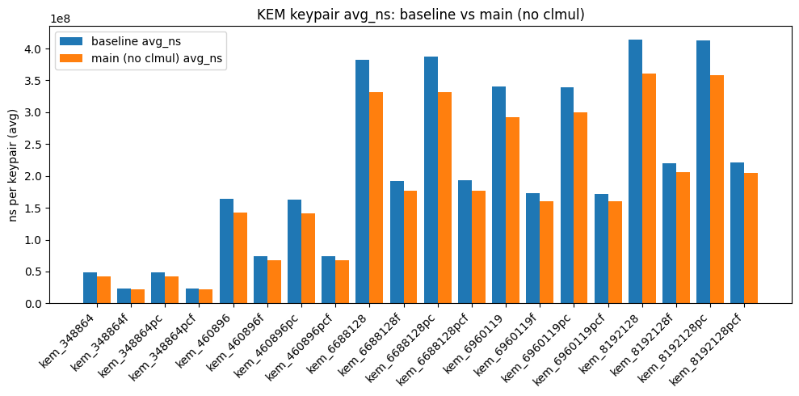

# 审稿意见分析与实验计划

周俊宇 2025/12/29

---

## 上次评论的意见

我将上次拒稿的审稿意见进行了整理，针对实验部分，梳理出以下几点（从重要到次要排序）：

### 一、评估方法不公、对比对象存疑：

- (44B) "This has several drawbacks: * as they say, this induces some overhead (memory management, initialization)... * more importantly, gf2x includes a tuning mechanism... Thus the comparison with gf2x is not fair." 

<v-click>

实验组：手写 carryless-mul 和 reduction，不使用任何封装。

对照组：调用了启用 gf2x 模块的 NTL，carryless-mul 部分由 gf2x 实现，reduction 部分由 NTL 实现。

</v-click>

<v-click>

我意识到了NTL封装可能带来的性能问题，在性能分析中计算了 NTL 开销可能带来的 overhead。上次 CHES 的审稿人并没有攻击这一点。然而这次 44B 注意到了，但他认为可能仅仅分析 overhead 不够，并且再加上我没提供 commit number 和是否使用 tuning 机制，仍然认为我的实验不公平。

解决方案：只用自己的手写 carryless-mul 算法，与 tuning 后的 gf2x 本身进行对比，不对比 reduction。

</v-click>

---

- (44B) "In 6.2 you compare to gf2x/NTL, but gf2x has no modular reduction!"

<v-click>

这是我的论文表述问题，44B 理解成了我同时跟 gf2x 和 NTL 做了对比，但实际上我做的是调用了启用 gf2x 模块的 NTL。解决方案同上个问题。

</v-click>

- (44C) Also, they say that 'gf2x currently lacks support for the dedicated carryless multiplication instructions'. How would NTL take advantage of these instructions and how big of an impact would they have? 

<v-click>

这是一个温和的问题。NTL 并没有对 arm/riscv 做硬件指令的优化，而 gf2x 也只做了 x86 的 pclmulqdq。因此，假如我在 gf2x 仓库中 push 了arm/riscv 硬件指令，gf2x和 NTL 都会获得硬件性能的提升。

</v-click>

--- 

### 二、ILP/DP 优化过程中的成本估算不准确

- (44B) "Another concern is that the DP optimization process is using some guessed costs for AND, OR, XOR, CLMUL. These costs can vary a lot between processors... It would be better to have a DP optimization process on real code..."

<v-click>

弱化这部分的建模文字，只给出 DP 代码，简要叙述一下建模过程和相关数据来源即可，并强调这些数据仅供参考，不保证“全局最优”。把重心放在具体硬件的实验数据上。

</v-click>

### 三、缺乏细粒度的加速分析

- (44C) "In the evaluation, it would be useful to see a more fine-grained analysis of the speed-up of the proposed algorithms... In the current state, it is impossible to tell, for example, how much of the speed-up in Figure 1 is due to improvements in multiplication and how much due to modular reduction."

- (44C) "In fact, I believe that such an analysis is more important than the subsequent evaluations they present in Sections 6.2 and 6.3, which hide the impact of the contribution behind unrelated overhead."

<v-click>

可以补充，但大概率 reduction 的性能提升很微小，因为 $\Delta$ 小的规约多项式目前并不常用。我打算将细粒度分析放在使用与不使用硬件指令的性能提升对比上。

</v-click>


---

### 四、缺乏具体案例和详细对比，验证声明困难

- (44A) "My main concern with the paper is the following. I would like details of at least one concrete example to verify the claims... For this field, the author can fix g(x), and provide the operation count for performing field multiplication using the best known previous method, and the operation count obtained from the new method."

<v-click>

审稿人想要一个完整的乘法（carryless+reduction）对应的 cycles，和目前的已知方法进行对比。然而我的数据只给了 carryless 的 cycles 分析。

解决方案是忽略该问题，参考合作者的意见，弱化 cycles 这一点，强调实验结果。

</v-click>

- (44A) "The implementation results reported by the authors seem to suggest a drastic improvement. So one would expect also expect a drastic reduction in the operation count by the new method over the previous method."

<v-click>

这似乎比较困难，因为不太好找一个只做 reduction “权威的例子” 作为对照组。因此我选择忽略该问题。

</v-click>

--- 

### 五、代码未公开，结果不可复现

- (44B) "Also, the authors' code is not available, which makes it hard to reproduce their results and/or understand what they have really implemented."

解决方案：公开实验代码以及测试数据。

### 六、其他疑问

- (44B) "Table 6: for m=409, I don't understand how you get 177 and 236 using K^*_3... Same for m=571..."

- (44B) "Page 17 'except at very large degrees': on my machine, the Karatsuba threshold for gf2x is 10 words, and 38 words for Toom-Cook, which is not 'very large degrees'."

解决方案：

关于第一个问题，可能是我自己哪儿算错，被他发现了。我也不知道自己当时是怎么想的。（但实际上我的论文被如此认真地对待，其实也是一件值得高兴的事情）

关于第二个问题，解决方案同之前的问题，弱化 cycles 建模过程，只提优化算法本身。（碰到了内行就是痛苦）

---

### 总结

- 彻底摒弃原有“调用 NTL 接口”的对照方式。直接对比你的手写 Carryless-mul 算法与原生、启用 Tuning 机制的 gf2x 库。
- 大幅缩减关于 ILP/DP 成本估算和 Operation Count（运算计数）的理论篇幅。仅保留代码和简要说明，作为启发式方法的参考，不再宣称其为“全局理论最优”。
- 放弃“乘法 vs 规约”的性能拆解。将分析重点转移到**硬件指令优化 vs 纯软件实现**的对比上。这能更直观地展示你的优化在不同架构（尤其是 ARM/RISC-V 等 NTL/gf2x 尚未充分优化的平台）上的实际贡献。
- 直接公开实验代码和测试数据，消除审稿人对“黑盒”的疑虑。
- 重新核算并修正 Table 6 中的数据错误（如 m=409/571 的递推计算）。

---

## HQC

> 一般情况下，这种 NIST 密码方案会提供两种实现方式。一种是不依赖 SIMD 指令的 ref 实现，还有一种是高度向量化的 optimized 实现。

许多人认为，HQC 的主要算术操作是在 $\mathcal{R} = \mathbb{F}_2[X] / (X^n - 1)$ 上的乘法。这的确是对的，因此在这个环上面做了不少的乘法优化操作。（ref 是直接调 gf2x，optimized 是调用 AVX 指令集和 karatsuba）

但是实际上，如果你真的用性能工具去分析一下函数的调用开销。你会发现：

- HQC 在译码的解封装操作中，需要频繁调用Reed-Solomon (RS) 码进行运算，而后者又依赖 $GF(2^8)$ 乘法。因此其实 $GF(2^8)$ 乘法步骤占了封装总时间的 40% 甚至更多。

而 ref 和 optimized 版本，他的规约代码（模 $x^8+x^4+x^3+x^2+1$）写得很丑，下面是我的优化代码：
<v-click>

```c
 static uint16_t gf_reduce(uint64_t x, size_t deg_x) {
    int H = x >> 8, L = x & 0xff;
    H ^= (H >> 4) ^ (H >> 5) ^ (H >> 6);
    H ^= (H << 4) ^ (H << 3) ^ (H << 2);
    return (L ^ H);
 }
```

</v-click>

<v-click>

而源代码长这样（见下页）：


</v-click>

---


```c
static uint16_t gf_reduce(uint64_t x, size_t deg_x) {
    uint16_t z1, z2, rmdr, dist;
    uint64_t mod;
    size_t steps, i, j;
    // Deduce the number of steps of reduction
    steps = CEIL_DIVIDE(deg_x - (PARAM_M - 1), PARAM_GF_POLY_M2);
    // Reduce
    for (i = 0; i < steps; ++i) {
        mod = x >> PARAM_M;
        x &= (1 << PARAM_M) - 1;
        x ^= mod;
        z1 = 0;
        rmdr = PARAM_GF_POLY ^ 1;
        for (j = PARAM_GF_POLY_WT - 2; j; --j) {
            z2 = trailing_zero_bits_count(rmdr);
            dist = (uint16_t) (z2 - z1);
            mod <<= dist;
            x ^= mod;
            rmdr ^= 1 << z2;
            z1 = z2;
        }
    }
    return x;
}
```

仅仅改了这里，HQC ref 版本在译码步骤快了 60%；而结合 SIMD 指令，也让我在 optimized 版本快了 20%。

---

HQC 的实验结果，还是引用之前的实验框架，首先按照不同安全参数 $\lambda=128,192,256$ 进行测试。对于每个安全参数，分别在 ref 和 optimized 运行对应的密钥生成、加密与解密测试。控制变量如下：

<v-click>

对于 ref 版本：

- baseline（x86/arm/riscv）
- 规约优化版本（x86/arm/riscv）
- 规约优化版本+SIMD（x86/arm/riscv）

</v-click>

<v-click>

对于 optimized 版本：

- baseline+pclmulqdq（x86）
- 规约优化版本+pclmulqdq（x86）

</v-click>

<v-click>

至于非进位乘法部分的优化，由于这里 $m=8$，反应不出非进位乘法部分的提升，而且修改这部分代码工作量太大，因此不作为实验变量。

这样我们尽可能同时兼顾到算法提升与硬件指令集带来的细粒度性能分析，最大程度满足了审稿人的要求。

</v-click>


---

## Mceliece

至于 Mceliece，还是先跑一下性能分析。我这里选择在 `crypto_kem/348864/avx/gf_2m_mul.c` 进行插桩（计数器加一，当达到 $10^6$ 的倍数时打印一句话）。当我跑一个正确性测试时，打印信息在不间断地更新，最后这个函数被打印了一亿次，说明 `gf_2m_mul.c` 的确是运行过程中的 hotpath。


然而，Mceliece 的作者是著名密码工程大佬 Daniel J. Bernstein，在规约部分，他没犯这样的低级错误：

```c
gf gf_mul(gf in0, gf in1)
{
    // t = 非进位乘法结果

    t = tmp & 0x7FC000;
    tmp ^= t >> 9;
    tmp ^= t >> 12;

    t = tmp & 0x3000;
    tmp ^= t >> 9;
    tmp ^= t >> 12;

    return tmp & GFMASK;
}
```

这段代码看上去并没有任何优化空间，于是我开始寻找它的父函数，发现了一个紧邻的文件 `gf_2mt_mul`：

---

函数是在域塔 $GF(2^m)^t$ 做乘法运算。而 $m=12,13$， $t \in [64,128]$，然而这个二重循环没有任何优化！

```c
void GF_mul(gf *out, const gf *in0, const gf *in1)
{
	int i, j;
	gf prod[ SYS_T*2-1 ];
	for (i = 0; i < SYS_T*2-1; i++)
		prod[i] = 0;

	for (i = 0; i < SYS_T; i++)
		for (j = 0; j < SYS_T; j++)
			prod[i+j] ^= gf_mul(in0[i], in1[j]);
           
  // 规约部分，省略
}
```

<v-click>

显然，这里的二重循环，本质上也就相当于普通的 schoolbook 乘法。于是这里当然可以用 karatsuba 算法来加速，为了减少递归开销，当 $t=16$ 时就使用普通的二重循环，而当$t=32, 64, 128$ 时就使用 karatsuba 算法减少 `gf_mul` 调用的次数——从而减少整体的时间开销。

</v-click>

<v-click>

当然，$t=16$ 的选取，和为什么要这么拆，就可以包装成论文非进位乘法贡献的一部分了。目前算一下在 vec 实现上有 7~17% 的性能提升，还是相当可观的。（至于 avx 实现，可能不是 hotpath，目前看来只有2.5~3.5%的提升）

</v-click>

---

对所有 20 个版本进行测试，分别在 `vec` 和 `avx` 环境下运行密钥生成、加密与解密测试。

<div class="grid grid-cols-2 gap-4 mt-4">

<div>

  <v-click>

  ### vec 版本 (x86)
  - **Baseline**: 基础实现
  - **非进位乘法优化**: 针对乘法进行优化
  - **非进位乘法优化 + SIMD**: 进一步结合 SIMD 指令集

  </v-click>

</div>

<div>

  <v-click>

  ### avx 版本 (x86)
  - **Baseline + PCLMULQDQ**: 基础实现结合 PCLMULQDQ 指令
  - **非进位乘法优化 + PCLMULQDQ**: 优化乘法并结合 PCLMULQDQ

  </v-click>

</div>

</div>

<div class="mt-4 border-t pt-4 flex justify-center">
  <v-click>
    
  </v-click>
</div>

---

## $t \le 16$ 就没有机会了吗？

我们观察批量做两次域乘法的 `crypto_kem/348864/avx/gf_2m_mul2.c`:

```c
uint64_t gf_mul2(gf a, gf b0, gf b1)
{
  // pclmulqdq tmp, a, (b0||b1) 

	t = tmp & 0x007FC000007FC000;
	tmp ^= (t >> 9) ^ (t >> 12);
	t = tmp & 0x0000300000003000;
	tmp ^= (t >> 9) ^ (t >> 12);
	return tmp & 0x00000FFF00000FFF;
}
```

而之前的那个规约算法，相对于 DJB 的优势就是可以从 $2(w_h-1)$ 次异或运算减少到 $2(w_h-2)$ 次——这对于 $w_h=3$ 的情况，这是翻倍的性能提升 ！代码如下：

```c
uint32_t H = tmp >> 12, L = tmp & 0x0FFF;
/* reduction: x^12 + x^3 + 1 */
H ^= (H >> 9);
H ^= (H << 3);
return (L ^ H) & GFMASK;
```

---

但是要将我的算法移植到 `gf_mul2` 上，需要克服跨 lane 位移时数据溢出时污染其他位的问题——而这刚好就是 SIMD 位移指令的语义——这真是奇妙的巧合，于是整个域乘法逻辑可以重写成这样：

```c
static inline uint64_t gf_mul2_simd(gf a, gf b0, gf b1) {
  const uint64_t b_packed = ((uint64_t)(uint32_t)b1 << 32) | (uint32_t)b0;

  __m128i va = _mm_set_epi64x(0, (uint64_t)a);
  __m128i vb = _mm_set_epi64x(0, b_packed);
  __m128i res = _mm_clmulepi64_si128(va, vb, 0x00);
  const uint64_t tmp64 = (uint64_t)_mm_cvtsi128_si64(res);

  // lane-wise reduction for x^12 + x^3 + 1, mask=0xFFF per 32-bit lane
  const __m128i x = _mm_cvtsi64_si128((long long)tmp64);
  const __m128i mask = _mm_set1_epi32(0x0FFF);

  __m128i L = _mm_and_si128(x, mask);
  __m128i H = _mm_srli_epi32(x, 12);
  H = _mm_xor_si128(H, _mm_srli_epi32(H, 9));
  H = _mm_xor_si128(H, _mm_slli_epi32(H, 3));
  __m128i out = _mm_and_si128(_mm_xor_si128(L, H), mask);

  return (uint64_t)_mm_cvtsi128_si64(out);
}
```

同样，我们也可以将该逻辑迁移到批量做4次乘法，甚至8次乘法中（需要 AVX-512 支持）。

---

简要的性能测试如下：

```shell
junyu33@zjy-asus /m/c/U/j/D/t/test> ./test_gf_mul2_bench                      
[OK] correctness: simd2/simd4 match reference (SYS_T=256)

=== Benchmark (iters=10000, total muls=655360000) ===
ref   :     1.240 ns/mul,     3.714 cycles/mul
simd2 :     0.756 ns/mul,     2.265 cycles/mul, speedup vs ref: 1.640x (time)
simd4 :     0.722 ns/mul,     2.162 cycles/mul, speedup vs ref: 1.718x (time)
```

<v-click>

可以发现，效果还不错，但由于感觉 simd4 相对于 simd2 并不显著。因此我只打算将 simd2 版本修补到 mceliece 的代码中。

</v-click>

<v-click>

并且，似乎可以加一个 standalone 的实验？

</v-click>