# The Missing Lecture of Your Cryptography

junyu33

2024/11/21

---

## Review of Probability Theory

DEF: We define $S^n$ as a vector (concatenation) of elements in set $S$, for example:

- $(010)$ is an element in ${\{0, 1}\}^3$

So there are $|S|^n$ elements in $S^n$, where $|A|$ ($\#A$) repesents the number of elements in set $A$ (cardinality).

<v-click>

DEF: **Probability distribution** $P$ over universe $U$ (finite) is a function $P$, which satisfies:

- $\forall x \in U, P(x) \ge 0$
- $\sum_{x \in U} P(x) = 1$

for example:

1. uniform distribution: $\forall x \in U, P(x) = \frac{1}{\mid U \mid}$
2. point distribution at $x_0$: $P(x_0) = 1, \forall x \ne x_0, P(x) = 0$

</v-click>

<v-click>

QUESTION: please describe the probability distribution when you roll up a dice.

</v-click>

---

DEF: For a set $A \subseteq U$, $Pr[A] = \sum_{x \in A} P(x) \in [0,1]$, the set $A$ is called an **event**:

<v-click>

for example:

1. $Pr[U] = 1$
2. If $U = {\{0, 1}\}^3$ and $x \in U$, $Pr[lsb_2(x)=11]=\frac{1}{4}$
3. For events $A_1$ and $A_2$, $Pr[A_1 \cup A_2] \le Pr[A_1] + Pr[A_2]$ 

</v-click>

<v-click>

DEF: A **ramdom varible** $X$ is a function $X$: $U \rightarrow V$, for example:

$X: \{0,1\}^n \rightarrow \{0,1\}$, $X(y) = lsb(y)$, we have:

$Pr[X=0]=Pr[X=1]=\frac{1}{2}$

</v-click>

<v-click>

DEF: Specifically, a **uniform ramdom varible** is a ramdom varible which satisfies:

$r \overset{R}{\leftarrow} U, Pr[r=a] = \frac{1}{\mid U \mid}$

</v-click>

<v-click>

QUESTION: please write two uniform ramdom varibles where $U = \{1, 2, 3, 4 ,5\}$ 

</v-click>

---

## Perfect Secrecy

DEF: A cipher $(E, D)$ over $(\mathcal{K}, \mathcal{M}, \mathcal{C})$ has **perfect secrecy** if:

$$\forall m_0, m_1 \in \mathcal{M}, len(m_0) = len(m_1) \land \forall c \in \mathcal{C}$$

$$ Pr[E(k, m_0) = c] = Pr[E(k, m_1) = c] $$

where $k$ is uniform in $\mathcal{K}$, i.e. ($k \overset{R}{\leftarrow} \mathcal{K}$)

<v-click>

The bad news is to satisfy this condition, we must have $|\mathcal{K}| \ge |\mathcal{M}|$, which makes it hard to use in practice.

As we have learned eariler, OTP (One-Time-Pad) is an example of cipher scheme which satisfies perfect secrecy.

</v-click>

<v-click>

QUESTION: Let $\mathcal{M} = \mathcal{C} = \mathcal{K} = \{0, 1, 2, \cdots, 255\}$ and consider the following cipher defined over $(\mathcal{K}, \mathcal{M}, \mathcal{C})$

$$ E(k,m) = m + k \pmod {256}; D(k, c) = c - k \pmod {256} $$

Does this cipher have perfect secrecy?

</v-click>

---

## Pseudo Random Generator (PRG)

So what will happen if we expand the ciphertext from OTP? Then it comes to the PRG:

<v-click>

DEF: In *Foundations of Cryptography: Basic Tools, page 113*, we define pseudo random generator $G$ as this:

> A pseudorandom generator is a deterministic polynomial-time algorithm $G$ satisfying the following 2 conditions:
>
> 1. There exists a function $l: \mathbb{N} \rightarrow \mathbb{N} \text{ s.t. } \forall n \in \mathbb{N}, l(n) > n \text{ and }  \forall s \in \{0, 1\}^*,  |G(s)| = l(|s|)$
> 2. Pseudorandomness: The ensemble $\{G(U_n)\}_{n \in \mathbb{N}}$ is pseudorandom (unpreditable). 
>
> The function $l$ is called the expansion factor of $G$, and the input $s$ to the generator is called its seed.
>
> (Mention that $|x|$ means the length for $x$, not the cardinality.)

</v-click>

<v-click>

One practical example of PRG is stream cipher, like RC4 and Salsa20, while the former one is found to have bias in initial output. 

Anyone intrested in this, please see details in paper *Statistical Analysis of the Alleged RC4 Keystream Generator, FSE 2001*.

</v-click>

---

## Predictability (Pseudorandomness)

As I said eariler, it is not practical to construct an encryption scheme which satisfies perfect secrecy. However, that doesn't mean an encryption scheme which doesn't have perfect secrecy is not secure, due to the limited power of adversary in practice.

To address security in cryptography, we need to clarify a set of security defnitions such as predictability and distinguishability (in the next slide):

<v-click>

DEF: We say that $G: K \rightarrow \{0,1\}^n$ is **predictable** if:

$$ \exists \text{eff alg. } A \text{ and } \exists_{0 \le i \le n-1} \text { s.t.}$$

$$ Pr_{k \overset{R}{\leftarrow} \mathcal{K}}[A(G(k))|_{1,\cdots,i} = G(k)|_{i+1}] > \frac{1}{2} + \varepsilon $$

for non-negligible $\varepsilon$ (e.g. $\varepsilon = \frac{1}{2^{30}}$)

DEF: PRG is unpreditable if it is not predictable.

</v-click>

---

## Semantic Security (Indistinguishability)

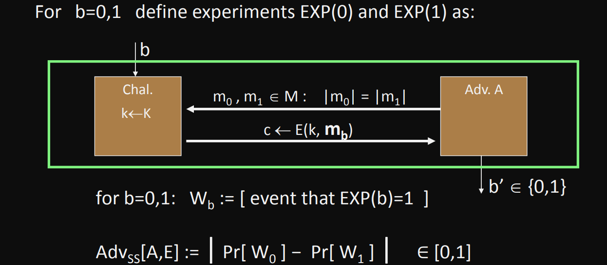

DEF: $E$ is semantically secure if for all efficient adversary $A$, $Adv_{ss}[A,E]$ is negligible.

---

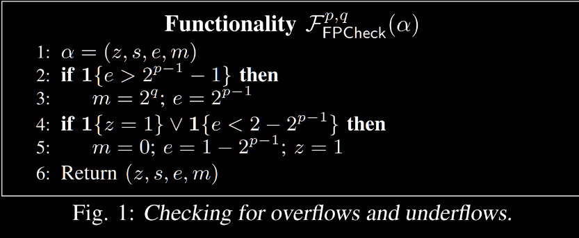

---

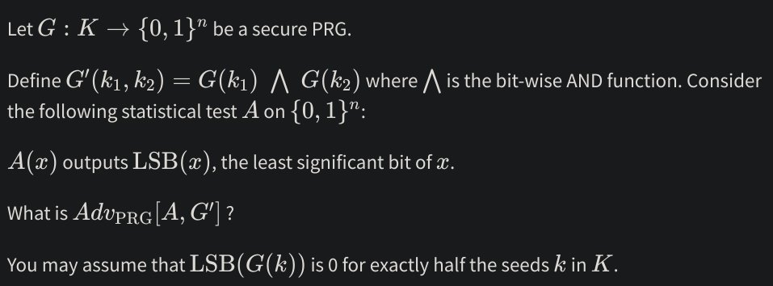

---

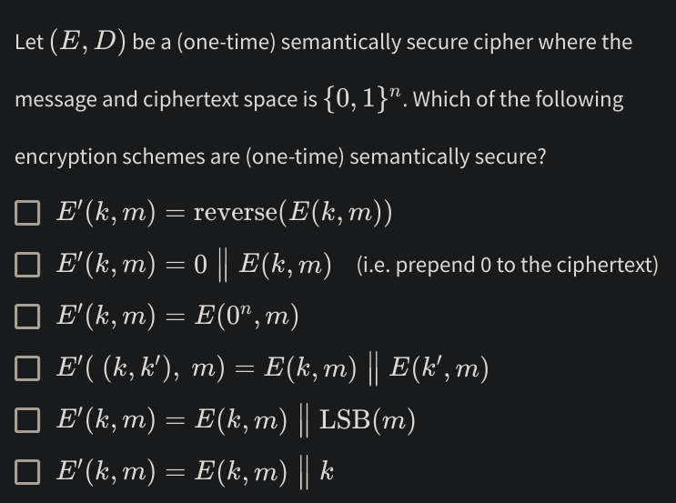

---

## PRF and PRP

In previous slides we discussed about PRG, which is widely used in block ciphers. Next we'll introduce PRF (pseudo random function) and PRP (pseudo random permutation).

<v-click>

PRF is defined over $(K, X, Y)$:

$$ F: K \times X \rightarrow Y $$

such that exists "eff" algorithm to evalutate $F(k,x)$.

</v-click>

<v-click>

PRP is defined over $(K, X)$:

$$ E: K \times X \rightarrow X $$

such that:

1. exists "eff" **deterministic** algorithm to evalutate $E(k,x)$.
2. $E(k, \cdot)$ is one-to-one, and exists "eff" inversion algorithm $D(k,y)$.

</v-click>

<v-click>

QUESTION: PRF can construct PRG easily, please provide an example.

</v-click>

---

Security requirements of PRF (*Introduction to Modern Cryptography, page 79*):

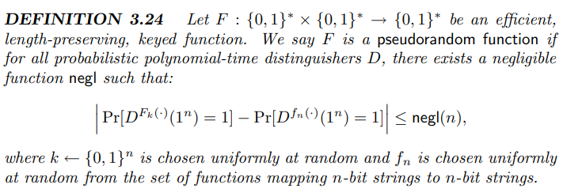

<v-click>

To be short, you can interpret $D(x)$ as binary classification function used in machine learning (only outputs 0 or 1), and $f_n(x)$ is a truly random function (TRF) chosen uniformly.

This equation means you can't use any method to tell which is which (PRF and TRF), so the $1^n$ can be any n-bit string, and the right-hand side can be 0 or 1, as long as they are the same.

</v-click>

---

Security requirements of PRP (*Introduction to Modern Cryptography, page 80*):

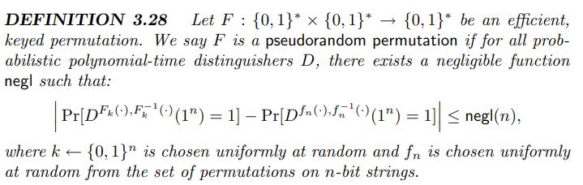

<v-click>

Just nearly the same as the PRF slide, since PRP is invertible, so we can add more constriants, like we may require the inverse function has the same property as the PRP. 

Therefore, making the whole encrypt-decrypt procedure indistinguishable from the TRP is necessary.

Someone may say this is boring, but that's what formality does.

</v-click>

<v-click>

QUESTION: Please write 2 real-world examples of secure PRP.

</v-click>

---

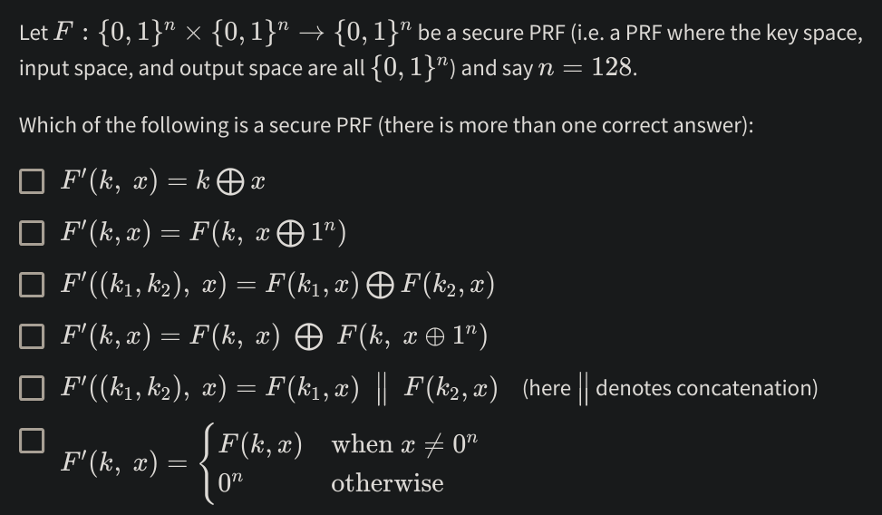

---

## CPA Security

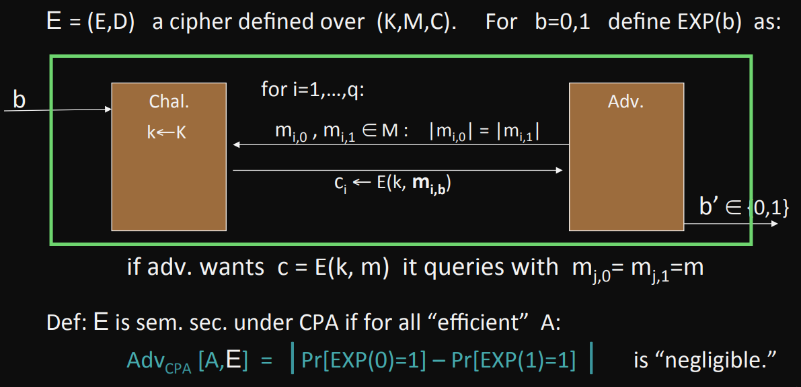

<v-click>

As you can see, CPA security is semantic security for many-time key senario.

</v-click>

---

QUESTION: Does OTP satisfiy CPA security? 

<v-click>

The answer is: NO! 

In fact, all deterministic encryption algorithm don't have CPA security. The proof is as follows:

</v-click>

<v-click>

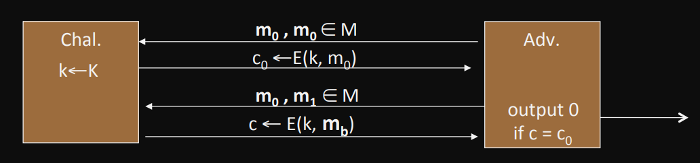

</v-click>

<v-click>

So how to solve this?

1. Randomized encryption: encrypt the plaintext at random times, and decrypt according to entropy.
2. Nonce-based encryption: CBC, CFB, CTR mode.

</v-click>

---

## Message Authentication Code (MAC)

DEF: Message authentication code $I=(S,V)$ defined over	$(\mathcal{K},\mathcal{M},\mathcal{T})$ is a pair of algs:

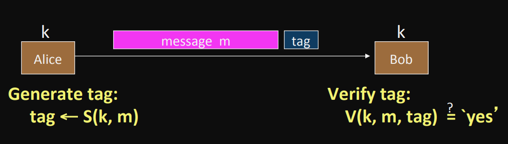

- $S(k,m)$ outputs $t$ in $\mathcal{T}$
- $V(k,m,t)$ outputs "yes" or "no".

<v-click>

QUESTION: Can MAC be constructed by PRF?

</v-click>

---

And it comes to the security definition:

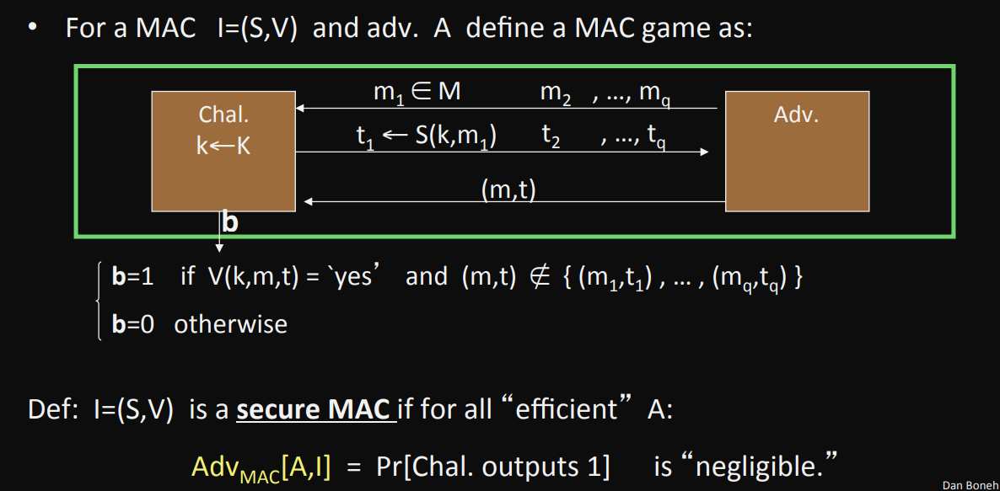

---

## Hash Function

DEF: Let $H: M \rightarrow T$ be a hash function. ($|M| \gg |T|$)

A collsion for $H$ is a pair $m_0, m_1 \in M \text{ s.t: }$ 

$$ H(m_0) = H(m_1) \land m_0 \ne m_1$$

A function $H$ is collsion resistant if for all "eff" algs. $A$:

$$ Adv_{CR}[A,H] = Pr[A \text{ outputs collsion for }H] \le \text{negl}(|M|)$$

Hash function only provide collsion resistance, not existential forgery. However we can use hash functions to build secure MACs (HMAC).

<v-click>

QUESTION: Is hash function a PRF?

</v-click>

---

## Generic Birthday Attack

First let me introduce the birthday paradox:

<v-click>

DEF (birthday paradox): Let $r_i \in \{1,\cdots,B\}$ be independent identically distributed integers. $Pr[\exists i\ne j: r_i = r_j] \ge \frac{1}{2}$ when $n = 1.2 \times \sqrt{B}$.

</v-click>

<v-click>

Proof: (for uniform indep. $r_i$)

$Pr[\exists i\ne j: r_i = r_j]=1-Pr[\forall i\ne j: r_i \ne r_j]=1-(\frac{B-1}{B})(\frac{B-2}{B})\cdots(\frac{B-n+1}{B})$

$=1-\prod_{i=1}^{n-1}(1-\frac{i}{B}) \ge 1-\prod_{i=1}^{n-1}(e^{-i/B})=1-e^{-\frac{1}{B}\sum_{i=1}^{n-1}i} \ge 1-e^{\frac{n^2}{2B}}$

Because $n = 1.2 \times \sqrt{B}$, $1 - e^\frac{n^2}{2B} = 1 - e^{0.72} = 0.53 > \frac{1}{2}$.

Q.E.D.

</v-click>

<v-click>

The reason why it is called a "paradox" is the number of people are much smaller than our expectation to achieve this probability. However, we can understand this by intuition:

$N$ numbers have roughly $N^2$ pairs, so if $N^2 > B$, a collsion may appear.

</v-click>

---

Now we can introduce generic birthday attack from this paradox:

<v-click>

Generic alg. to find a collision in time $O(\sqrt{T})$ hashes:

1. Choose $\sqrt{T}$ random messages in $M$: $\{m\}_{1,2,\cdots,\sqrt{T}}$.
2. Compute $t_i = H(m_i)$ for $i = 1,2,\cdots,\sqrt{T}$.
3. Look for a collision $(t_i=t_j)$. If not found, go back to step 1.

</v-click>

<v-click>

QUESTION: What is the expected number of finding a collision using this algorithm?

</v-click>

<v-click>

HARDER QUESTION: How many integers (chosen from $[1,B]$) do you expect to choose so that the probability of finding a triple collision (having three same numbers) is higher than 50%?

</v-click>

<v-click>

      

    TIME FOR A BREAK

</v-click>

---

## CCA Security

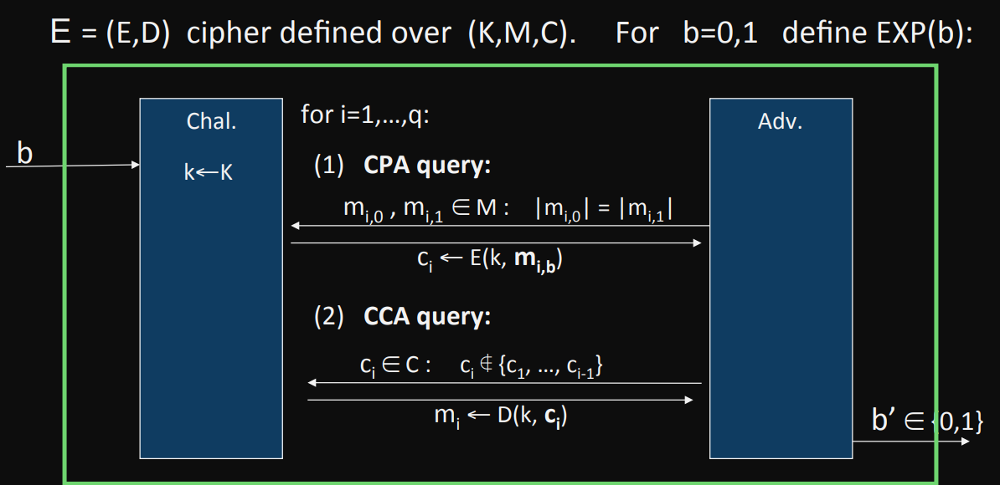

---

$E$ is CCA secure if for all "eff" A:

$$ Adv_{CCA}[A,E]= | Pr[EXP(0)=1]-Pr[EXP(1)=1] | \le \text{negl}$$

<v-click>

And we have a concrete example: CBC with rand. IV is not CCA-secure (insecure under active attacks).

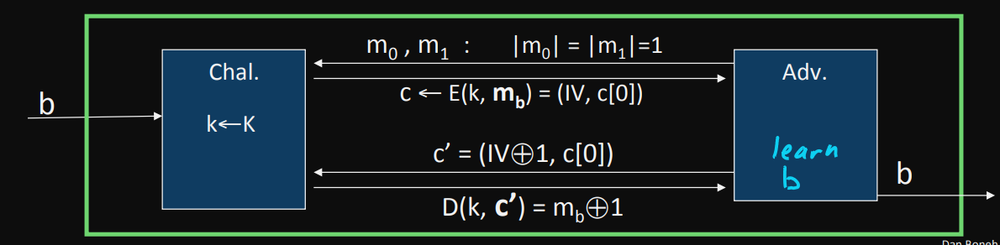

</v-click>

<v-click>

Suppose Alice wants to send Bob `Borrow me $10000` (16 bytes), Eve wants to modify the 12th bit from `0x31` to `0x32`. 

To do this, Eve can intercept encryption message and let `IV[11] = IV[11] ^ 0x31 ^ 0x32`, then Bob will get `Borrow me $20000` after decryption using the modified IV.

</v-click>

---

## Authenticated Encryption (AE)

To solve this problem, authenticated encryption was invented to provide confidentiality against active attacks (i.e. provide CCA security).

<v-click>

An authenticated encryption (AE) system is a cipher where:

- $E: K \times M \times N \rightarrow C$
- $D: K \times C \times N \rightarrow M \cup \{\perp\}$

</v-click>

<v-click>

DEF: cipher $(E,D)$ provides AE if it is:

- sem. security under a CPA attack.
- ciphertext integrity: attack cannot create new ciphertexts that decrypt properly.

</v-click>

---

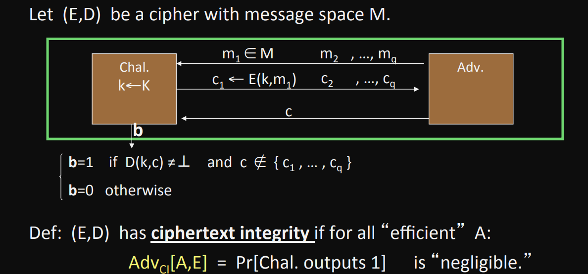

---

## Construction of AE

Since we didn't learn AE, the implementation is a little tricky for newcomers. Here is a question for you:

<v-click>

QUESTION: We often combine MAC and ENC together to achieve AE, so which of the implementations provide AE? Suppose encryption key is $k_E$ and MAC key is $k_I$.

1. (SSL): let $tag = S(k_I, m)$, $res = E(k_E, m||tag)$.
2. (IPSec): let $c = E(k_E, m)$, $tag = S(k_I, c)$, $res = c || tag$.
3. (SSH): let $c = E(k_E, m)$, $tag = S(k_I, m)$, $res = c || tag$.

</v-click>

<v-click>

The SSH way is obviously wrong, because let $tag = S(k_I, m)$ already exposes some information about $m$.

The SSL way is sometimes correct if $(E,D)$ provides randomized encryption like rand-CTR or rand-CBC. Otherwise it may be insecure (image $(E,D)$ using OTP).

Therefore, the answer is IPSec (encrypt then MAC), it is always correct.  

</v-click>

---

QUESTION: Let $(E, D)$ be an encryption system with key space $K$, message space $\{0, 1\}^n$ and ciphertext space $\{0, 1\}^s$. Suppose $(E, D)$ provides authenticated encryption. Which of the following systems provide authenticated encryption: (as usual, we use $\parallel$ to denote string concatenation)

1. 
   $$ E'(k, m) = \left( E(k, m), H(m) \right) \text{ and }
   D'(k, (c, h)) = \begin{cases} 
   D(k, c) & \text{if } H(D(k, c)) = h \\ 
   \perp & \text{otherwise}
   \end{cases}
   $$

2. 
   $$E'(k, m) = \left[ c \leftarrow E(k, m), \text{output } (c, c) \right] \text{ and }
   D'(k, (c_1, c_2)) = \begin{cases} 
   D(k, c_1) & \text{if } c_1 = c_2 \\ 
   \perp & \text{otherwise}
   \end{cases}
   $$

3. 
   $$E'(k, m) = \left( E(k, m), E(k, m) \right) \text{ and } D'(k, (c_1, c_2)) = D(k, c_1)$$

4. 
   $$E'((k_1, k_2), m) = E(k_2, E(k_1, m)) \text{ and } 
   D'((k_1, k_2), c) = \begin{cases} 
   D(k_1, D(k_2, c)) & \text{if } D(k_2, c) \neq \perp \\ 
   \perp & \text{otherwise}
   \end{cases}
   $$

---

## Deterministic Encryption (DE)

Suppose we have a database containing sensitive user information, such as government ID. We want to encrypt the IDs to protect user privacy, but we still need to be able to efficiently search for specific IDs in the database. That's when deterministic encryption takes place.

<v-click>

Of course, deterministic encryption cannot be CPA secure, the adversary can perform this attack:

Attacker can first choose $m_0, m_0$ and the server returns $c_0$.

After that, attacker choose $m_0, m_1$ and server will return $c_0$ or $c_1$. Since attacker knows the content of $c_0$, it can win CPA game.

</v-click>

<v-click>

The solution to this problem is **never encrypts same message twice**. This happens when encryptor:

- Chooses messages at random from a large message space $\mathcal{M}$.
- Message structure ensures uniqueness.

</v-click>

---

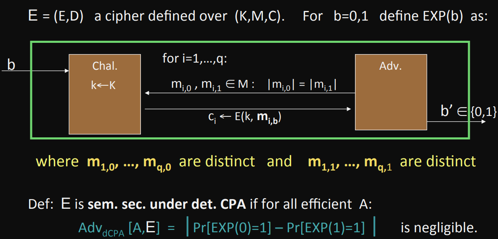

<v-click>

QUESTION: Is CBC or CTR mode with fixed IV det. CPA secure?

QUESTION: Is PRP det. CPA secure?

</v-click>

---

## Synthetic IV (SIV) 

Although PRP is capable of building a det. encryption, PRP is not flexible because you need to build an n-bit PRP for n-bit messages. This is not convenient if you have a message with legnth $2^{20}$ bits.

Synthetic IV (SIV) can solve this problem, to be specific:

<v-click>

Let $(E,D)$ be a CPA secure encryption: $E(k, m; r) \rightarrow c$

Let $F: K \times M \rightarrow R$ be a secure PRF.

DEF: 

$$E_{det}((k_1, k_2), m) = \begin{cases} 
   r \leftarrow F(k_1, m) \\ 
   c \leftarrow E(k_2, m; r) \\
   \text{output r} \\
   \end{cases}$$

Then $E_{det}$ is sem. sec. under det. CPA.

</v-click>

---

## Deterministic Authenticated Encryption (DAE)

To modify SIV a little bit, we can get deterministic authenticated encryption (DAE) using CTR mode.

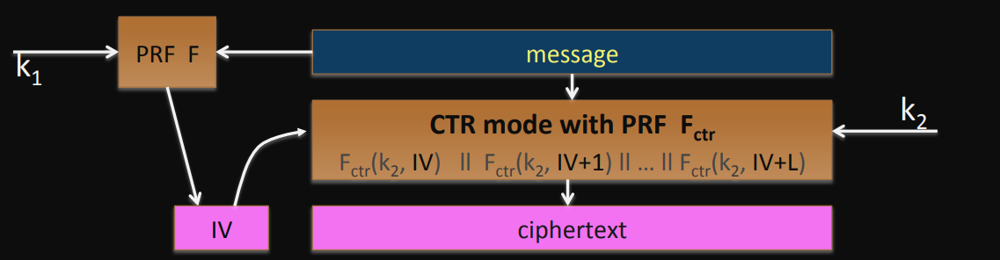

<v-click>

How about using PRP to do DAE? The easiet method is to append $\lambda$ bits of zeros, and check if the decryption has $\lambda$ bits of zeros at the end. Since PRP is pseudorandom, the probability of faking an encryption is $\frac{1}{2^\lambda}$, which is negligible.

There are also ways to expand PRP from $\{0,1\}^n$ to $\{0,1\}^N$ where $N \gg n$ like EME. However it is 2x slower than SIV so I'm not going to talk about it in this lecture.

</v-click>

---

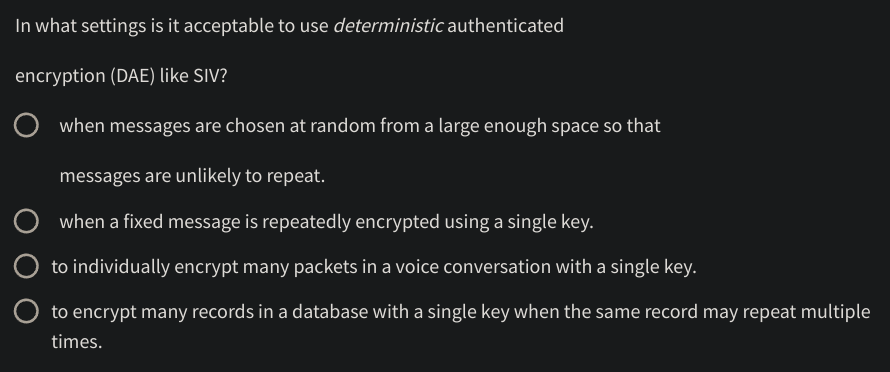

---

## Symmetric Encryption Summary

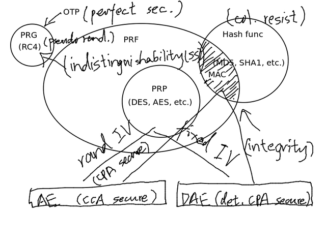

---

## Public Key Encryption Intro

Suppose $N$ people wants to share information with each other without eavesdropping. 

<v-click>

The basic solution is to use a separate symmetric key for each pair, $O(N^2)$ keys in total. 

However this is of course inefficient.

</v-click>

<v-click>

A better solution is to use a trusted third party (TTP), if Alice and Bob wants to communicate with each other. They first store their symmetric key in TTP. In this way, they only need to save their own key, $O(N)$ keys in total.

Alice can encrypt her message $c = Enc(k_A, m)$, TTP uses $k_A$ to decrypt $c$ and uses Bob's key $k_B$ to send $c'=Enc(k_B,m)$ to Bob again. Bob then use his own key to decrypt $c'$ and get $m$.

</v-click>

<v-click>

QUESTION: So, can we do it without using TTP?

</v-click>

---

## Merkle Puzzles

Suppose we have a symmetric cipher $E(k,m)$ with $k \in \{0, 1\}^{128}$.

<v-click>

Alice: 
- Prepare $2^{32}$ puzzles, for $i = 1,2,\cdots,32$, choose rand. $P_i \in \{0, 1\}^{32}$ and $(x_i, k_i) \in \{0,1\}^{128}$.
- Set $puzzle_i = E(0^{96}||P_i, \text{ "Puzzle \#}x_i\text{" } || k_i)$.
- Send $\{puzzle_i\}_{1,2,\cdots,2^{32}}$ to Bob.

</v-click>

<v-click>

Bob:

- Choose a random puzzle $puzzle_j$ to solve it and obtain $(x_j, k_j)$.
- Send $x_j$ to Alice.

</v-click>

<v-click>

Complexity:

- Alice: $O(n)$ time and $O(n)$ space.
- Bob: $O(n)$ time.
- Eve: $O(n^2)$ time.

</v-click>

--- 

## Diffie-Hellman Key Exchange (DHKE)

However, the efficiency of merkle puzzles is too low, so we have Diffie-Hellman key exchange.

- SETUP(): a large prime $p$ (e.g. 600 digits), an integers $g$ (usually primitive root).
- Alice: choose random $a$ in $[1, p-1]$, send $A = g^a$ to Bob.
- Bob: choose random $b$ in $[1, p-1]$, send $B= g^b$ to Alice.
- Alice calculate $k_{AB} = B^a$, Bob calculate $k_{AB} = A^b$, then they can communicate using $k_{AB}$.

<v-click>

Since $B^a = (g^b)^a = g^{ab} = (g^a)^b = A^b$, this algorithm is valid.

Since knowing $g^a$ and $g^b$ is known to be hard to calculate $g^{ab}$ (Dlog problem), this algorithm provide computation security when $p$ is large enough.

The known best algorithm to solve Dlog problem, GNFS, has a complexity $O(\text{exp}(n^{1/3}))$, where $n$ is the digit number of $p$.

</v-click>

<v-click>

However, this key exchange algorithm only provides eavesdropping security. It cannot prevent active attacks, such as MitM.

</v-click>

---

## Public Key Encryption

<v-click>

A different approach for key exchange is public key encryption. Here is the definition:

DEF: a public-key encryption system is a triple of algs $(G, E, D)$:

- $G():$ randomized alg. outputs a key pair $(pk, sk)$.
- $E(pk, m):$ **randomized** alg. that takes $m \in \mathcal{M}$ and outputs $c \in \mathcal{C}$.
- $D(sk, c):$ det. alg. that $c \in \mathcal{C}$ and outputs $m \in \mathcal{M}$ or $\perp$.
- $\forall m \in \mathcal{M}, D(sk, E(pk, m)) = m$.

</v-click>

<v-click>

QUESTION: Is public key encryption able to solve MitM problem?

</v-click>

<v-click>

QUESTION: What level of security does public key encryption at least satisfiy?

- semantic security
- CPA security
- CCA security
- ind. CPA security

</v-click>

---

## CCA Security for Public Key Encryption

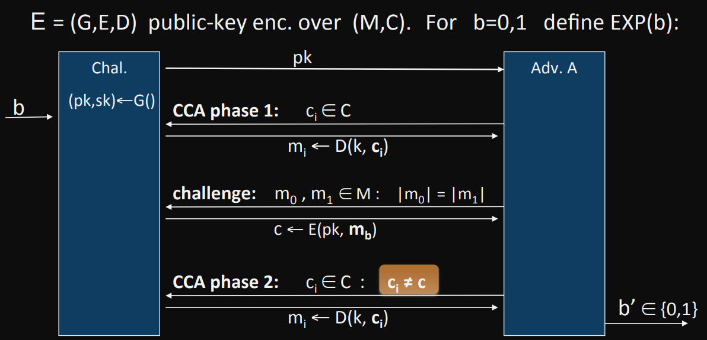

DEF: E is CCA secure if for all "eff" A: $Adv_{CCA}[A,E]=|Pr[\text{EXP}(0)=1]-[Pr[\text{EXP}(1)=1]| \le \text{negl}$

---

## Trapdoor Function (TDF)

Next we consider specific implementations of public key encryption, one of them is using trapdoor function:

DEF: a trapdoor function $X\rightarrow Y$ is a triple of "eff" algs $(G, F, F^{-1})$:

- $G():$ randomized alg. outputs a key pair $(pk, sk)$.
- $F(pk, \cdot):$ **det.** alg. that defines a function $X\rightarrow Y$.
- $D(sk, \cdot):$ defines a function $Y\rightarrow X$ that inverts $F(pk, \cdot)$.
- $\forall x \in X, F^{-1}(sk, F(pk, x)) = x$.

<v-click>

QUESTION: 

- Can you find the major difference from public key encryption? 
- Can we use TDF directly to build public key encryption?

</v-click>

---

## RSA Trapdoor Permutation

- $G():$ 
    - choose random primes $p,q$ 1024 bits. Set $N = pq$.
    - choose integers $e,d \text{ s.t } ed = 1 \pmod {\varphi(N)}$.
    - output $pk = (N,E), sk = (N,d)$.
- $F(pk, x):$ $y=x^e$
- $D(sk, y):$ $y^d = x^{ed} = x^{ed \mod{\varphi(N)}} = x^1 = x$.

<v-click>

The security statement is: for all efficient algs. $A$:

$$ Pr[A(N,e,y)=y^{1/e}] < \text{negl}(N) $$

which is supported by the difficulty of factoring big integers.

</v-click>

<v-click>

By using RSA as a TDF and adding some randomness, we can construct RSA public key encryption easily.

</v-click>

---

## RSA Public Key Encryption

$(E_s, D_s)$ symmetric enc. scheme provide AE, $H: Z_N \rightarrow K$ where K is keyspace of $(E, D)$.

- $G():$ 
    - choose random primes $p,q$ 1024 bits. Set $N = pq$.
    - choose integers $e,d \text{ s.t } ed = 1 \pmod {\varphi(N)}$.
    - output $pk = (N,E), sk = (N,d)$.
- $F(pk, x):$ 
    - choose random $x$ in $Z_N$
    - $y=x^e$, $k \leftarrow H(x)$.
    - output $y, E_s(k, m)$.
- $D(sk, (y, c)):$ 
    - output $D_s(H(RSA^{-1}(y)), c)$.

---

## Wiener's Attack

However, as a TDF, RSA itself isn't secure enough, Wiener proves that if $d \le N^{0.25}/3$ then RSA is insecure.

<v-click>

Proof:

$$ ed = 1 \pmod{\varphi(N)} \Rightarrow \exists k \in \mathbb{Z}, ed = k\cdot\varphi(N)+1$$

$$ |\frac{e}{\varphi(N)} - \frac{k}{d}| = \frac{1}{d\cdot\varphi(N)} \le \frac{1}{\sqrt{N}}$$

since $\varphi(N)=N-p-q+1$, $|N-\varphi(N)| \le p + q \le 3 \sqrt{N}$

$$ d \le N^{0.25}/3 \Rightarrow |\frac{e}{N} - \frac{k}{d}| \le |\frac{e}{N} - \frac{e}{\varphi(N)}| + |\frac{e}{\varphi(N)} - \frac{k}{d}| = |\frac{e(\varphi(N)-N)}{N\cdot \varphi(N)}| + |\frac{e}{\varphi(N)} - \frac{k}{d}|$$

$$ <= \frac{3\sqrt{N}}{N} + \frac{\sqrt{N}}{N}=\frac{4}{\sqrt{N}} < \frac{1}{2d^2}$$

</v-click>

<v-click>

As you can see, $|\frac{e}{N} - \frac{k}{d}|$ is very small, so continued fraction of $\frac{e}{N}$ gives $\frac{k}{d}$. Q.E.D.

</v-click>

---

Suppose $N=90581, e=17993$, we can try to write the continued fraction of $\frac{e}{N}$.

<v-click>

- $17993 = 0 \times 90581 + 17993$, then $q_0 = 0$.
- $90581 = 5 \times 17993 + 616$, then $q_1 = 5$.
- $17993 = 29 \times 616 + 128$, then $q_2 = 29$.
- $616 = 4 \times 128 + 104$, then $q_3 = 4$.

</v-click>

<v-click>

Then we have $e/N$ = $[0, 5, 29, 4, 1, 3, 2, 4, 3]$.

</v-click>

<v-click>

We can have convergents like:

$0$, $\frac{1}{5}$, $\frac{1}{5+\frac{1}{29}}=\frac{29}{146}$,$\frac{1}{5+\frac{1}{29+\frac{1}{4}}}=\frac{117}{589},\frac{146}{735},\frac{555}{2794},\frac{1256}{6323},\frac{5579}{28086},\frac{17993}{90581}$.

And we can try $\varphi(N)=\frac{ed-1}{k}$: $k=1,d=5$ satisfies, we got $\varphi(N)=89964$, other pairs can't be an integer.

</v-click>

<v-click>

Solve $x^2-((N-\varphi(N))+1)x + N = 0$, we got $(239, 379)$, and we've found factorization of $N$, which breaks the whole RSA system.

</v-click>

---

## ElGamal Public Key system

Since RSA has some defects, ElGamal, which is based on Diffie-Hellman Key Exchange, came out of place.

<v-click>

First, let's recap DHKE:

> - SETUP(): a large prime $p$ (e.g. 600 digits), an integers $g$ (usually primitive root).
> - Alice: choose random $a$ in $[1, p-1]$, send $A = g^a$ to Bob.
> - Bob: choose random $b$ in $[1, p-1]$, send $B= g^b$ to Alice.
> - Alice calculate $k_{AB} = B^a$, Bob calculate $k_{AB} = A^b$, then they can communicate using $k_{AB}$.

QUESTION: what will happen if we treat $A$ as $pk$?

</v-click>

<v-click>

Therefore, a basic ElGamal protocol is invented.

- SETUP(): a large prime $p$ (e.g. 600 digits), an integers $g$ (usually primitive root).
- Alice: choose random $a$ in $[1, p-1]$, send $A = g^a$ to Bob.
- Bob: choose random $b$ in $[1, p-1]$, encrypt $m$ using $k_{AB} = A^b$, send $(B=g^b, E_s(k_{AB}, m))$ to Alice.
- Alice calculate $k_{AB} = B^a$, decrypt $m = D_s(k_{AB}, c)$.

</v-click>

---

And here is a more modern version:

- $G:$ finite cyclic group of order $n$, random generator $g \in G$.
- $\text{sk} = a \overset{R}{\leftarrow}Z_n$, $\text{pk} = (g, h=g^a)$. 
- $(E_s, D_s):$ symmetric AE defined over $(\mathcal{K}, \mathcal{M}, \mathcal{C})$.
- $H: G^2 \rightarrow K$ a hash function.

<v-click>

$E(\text{pk}=(g,h), m):$

- $b \overset{R}{\leftarrow} Z_n, u \leftarrow g^b, v \leftarrow h^b$.
- $k \leftarrow H(u,v), c \leftarrow E_s(k,m)$.
- $\text{output }(u,c)$.

</v-click>

<v-click>

$D(\text{sk}=a,(u,c)):$

- $v = u^a$.
- $k = H(u,v), m \leftarrow D_s(k,c)$.
- $\text{output } m$.

</v-click>

---

## ElGamal CCA Security

In previous sections, we know basic ElGamal protocol relies on Dlog problem, just as same as Diffie-Hellman key exchange. However, it is vulnerable to MitM attacks. So the question is:

QUESTION: Does modern version of ElGamal provide CCA security?

To solve this question, let's look at several security assumptions:

- Computational DH (CDH): for all "eff" algs. $A$, $Pr[A(g, g^a, g^b)=g^{ab}] < \text{negl}$.
- Hash DH (HDH): $H: G^2 \rightarrow K$ as a hash function, $(g, g^a, g^b, H(g^b, g^{ab})) \approx_p (g, g^a, g^b, R)$.
- Interactive DH (IDH): for all "eff" $A$, $Pr[A \text{ outputs } g^{ab}] < \text{negl}$.

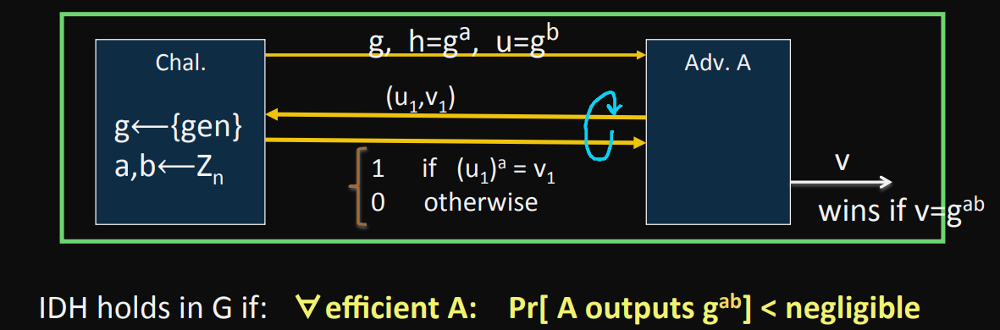

---

In fact, if:

- IDH holds in the group $G$;
- $(E_s, D_s)$ provides AE;
- $H: G^2 \rightarrow K$ is a "random oracle".

then ElGamal is $CCA^{ro}$ secure.

<v-click>

QUESTION:

- Can we prove CCA security based on CDH?
- Can we prove CCA security without random oracles?

</v-click>

---

## ElGamal Variants

Twin ElGamal:

- SETUP(): $g \in G \text{ and } a_1, a_2 \in Z_n$, output $\text{pk} = (g, h_1=g^{a_1}, h_2=g^{a_2})$, $\text{sk}=(a_1, a_2)$.
- $E(\text{pk}=(g,h_1,h_2),m)): b\leftarrow Z_n$
    - $k \leftarrow H(g^b, h_1^b, h_2^b)$.
    - $c \leftarrow E_s(k, m)$.
    - $\text{output } (g^b, c)$.
- $D(\text{sk}=(a_1,a_2),(u,c)):$
    - $k \leftarrow H(u, u^{a_1}, u^{a_2})$.
    - $m \leftarrow D_s(k, c)$.
    - $\text{output } m$.

<v-click>

You can observe this algorithm "has a beauty of symmetry".

</v-click>

<v-click>

Another popular variant is ElGamal on ECC (ECELG), you will learn/have already learnt in your textbook.

</v-click>

---

## Public Key Encryption Summary

---
layout: end
---

THANKS FOR YOUR LISTENING!