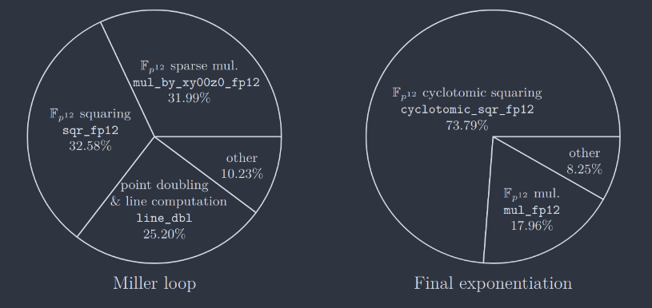

# Fast AVX-512 Implementation of the Optimal Ate Pairing on BLS12-381

Hao Cheng, Georgios Fotiadis, Johann Großschädl, Daniel Page

---

## 上次内容回顾

在上次分享中，我们介绍了 Weil pairing 和 Tate pairing 在密码学中的应用。其中对于 reduced Tate pairing 的内容摘要如下：

<v-click>

> Tate pairing 与 weil pairing 的区别是其椭圆曲线定义在有限域 $\mathbb{F}_q$ 上，而后者可以是任意域。我们定义：
>
> $$
> \hat\tau_\ell(P, Q) = (\frac{f_{\ell,P}(Q + S)}{f_{\ell,P}(S)})^{(q-1)/\ell} \in \mathbb{F}_q
> $$
>
> 其中 $\ell$ 是质数，$P \in E(\mathbb{F}_q)[\ell]$，$Q \in E(\mathbb{F}_q)$，$q \equiv 1 \pmod \ell$.

</v-click>

<v-click>

实际上更一般的情况是，reduced Tate pairing 也可以在扩域 $\mathbb{F}_{q^k}$ 定义，这里的 $k$ 称为 embedding degree，满足 $\ell \mid q^k - 1$。则上一节的计算形式则应该对应：

$$
\hat{t}_\ell(P,Q)
=
\left(
\frac{f_{\ell,P}(Q+S)}{f_{\ell,P}(S)}
\right)^{(q^k-1)/\ell}
\in \mu_\ell \subset \mathbb{F}_{q^k}^* .
$$

</v-click>

<v-click>

在密码学语境中，原来的分式 $\frac{f_{\ell,P}(Q+S)}{f_{\ell,P}(S)}$ 通常会被简写为 $f_{\ell,P}(D_Q)$，其中 $D_Q$ 是代表 $Q$ 的零次除子，例如 $D_Q = [Q+S] - [S]$。其实就是上次分享中“有理函数对除子求值”的形式：正项进分子，负项进分母。

</v-click>


---

## 从 reduced Tate 到 optimal ate

然后回到上一次组会的未来预告：

> 可以发现，reduced Tate pairing 的 Miller function 计算量比 Weil pairing 少一半，并且仍满足单位根和双线性两个性质，所以在密码学中更受青睐。例如 Tate pairing 的变种 ate pairing 在以太坊中被广泛使用，而 CHES 上现在仍有针对 optimal ate pairing 的优化工作。
> https://eprint.iacr.org/2025/1283

<v-click>

上一次分享提到：Weil pairing 需要两个 Miller 函数；reduced Tate 只需要一个。接下来真正的优化，是让这一个 Miller loop 尽可能短。

</v-click>

<v-click>

Miller 算法按整数 $m$ 的二进制展开做 double-and-add：

$$
\text{div}(f_P)=m[P]-[mP]-(m-1)[\mathcal{O}]
$$

这里的 $m$ 就是 Miller loop 的参数；$m$ 越短，循环越短。

</v-click>

<v-clicks>

- reduced Tate pairing：Miller loop 扫 $\ell$，其中 $\ell$ 是曲线大素数阶子群的阶。
- ate pairing：针对椭圆曲线，Miller loop 扫 $T=t-1$，其中 $t$ 是 Frobenius trace。
- optimal ate pairing：进一步利用 pairing-friendly curve 的参数化结构，让 loop parameter 接近理论最短。

</v-clicks>

---

## BLS12-381 实现

这里以 BLS12-381 为例。它是一条常用的 pairing-friendly elliptic curve，定义在约 $381\text{-bit}$ 的素域上，嵌入次数 $k=12$，常用于 BLS signatures、zk-SNARKs 和以太坊相关协议。

<v-click>

回到上一页，对于经典的 reduced Tate pairing，Miller loop 参数

$$\ell \approx 255\text{-bit}$$

</v-click>

<v-click>

对于 ate pairing，Hasse 定理

$$\#E(\mathbb{F}_q)=q+1-t,\qquad |t|\le 2\sqrt q$$

告诉我们 $t \sim \sqrt{q}$，因此 Miller loop 参数 $T=t-1 < 192\text{-bit}$。

</v-click>

<v-click>

而对于 optimal ate pairing，通过进一步利用曲线 seed $z$，
把 loop parameter 降到：

$$
\qquad z \approx 64\text{-bit}.
$$

因此可以粗略理解为：optimal ate 用更短的整数来跑 Miller loop，相比于最开始的 reduced Tate pairing 有 $4 \times$ 的速度提升。

</v-click>

---

## 这篇论文优化什么？

我们现在要面对的是这样的一个式子，我们记 optimal ate pairing 为 $e_{\mathrm{OATE}}$，则：

$$
\hat{\tau}_\ell(P,Q)
=
f_{\ell,P}(D_Q)^{(q^k-1)/\ell}
\quad\Longrightarrow\quad
e_{\mathrm{OATE}}(Q,P)
=
f_{z,Q}(D_P)^{(q^{12}-1)/\ell}.
$$

<v-click>

主要分为两部分的计算，第一部分就是 $f_{z,Q}(D_P)$ 这个 Miller loop，第二部分就是做 $(q^{12}-1)/\ell$ 这个 final exponentiation，下图给出了这两块各自时间的占比：

</v-click>

<v-click>

<div class="flex justify-center mt-4">
  
</div>

</v-click>

---

然后我们立即有两个问题需要解答：What to optimize? How to optimize?

<v-click>

对于第一个问题，为了得到最大 speedup，Cheng 等人自然是除了 other 之外，全都要优化。具体而言，论文提出了以下六个优化点：

</v-click>

<v-click>

- $F_{p^{12}}$ cyclotomic squaring (`cyclotomic_sqr_fp12`)
- $F_{p^{12}}$ multiplication (`mul_fp12`)
- $F_{p^{12}}$ sparse multiplication (`mul_by_xy00z0_fp12`)
- $F_{p^{12}}$ squaring (`sqr_fp12`)
- point doubling & line computation (`line_dbl`)
- point addition & line computation (`line_add`)

</v-click>

<v-click>

而对于后者，他们敏锐的发现 BLS12-381 曲线广泛使用的高性能实现 blst（就是用在以太坊的那个）的确使用了 x64 assembly、`BMI2/ADX` 等标量大整数优化；但这并不是 SIMD 的向量化实现，因此这给具有高度向量化的 `AVX-512IFMA` (Integer Fused Multiply-Add) 指令的机器带来了优化空间。

</v-click>

<v-click>

> 这其实也解释了为什么 blst 不做，因为支持这种指令集的设备很少，而区块链共识/验证路径需要稳定、可移植，这本身就存在一些 tradeoff.

</v-click>

---

## AVX-512IFMA 本身能力

论文使用的指令集是 `AVX512-IFMA`，`AVX512` 代表存在长度为 512bit 的向量寄存器，可以看成 8 个 64-bit lane 的小寄存器同时进行某种相同的操作（比如说 xor、and 等等）;`IFMA` 则代表一种专门的 SIMD 操作：52-bit 多精度整数乘法。

具体而言，`AVX512-IFMA` 有两个指令： `vpmadd52luq` 和 `vpmadd52huq`,它们每个 lane 做的事情可以粗略理解为：

<v-click>

```c
dst += low_52_bits(a * b)
dst += high_52_bits(a * b)
```

也就是取每个 lane 64 bit 的低 52 bit，做乘法操作会得到 104 bit，将高 52 bit 和低 52 bit 直接相加得到结果。

而 AVX512 有 8 个 lane，也就是一条指令可以同时做 8 次这样的操作。

</v-click>

<v-click>

这个指令作为论文的 building block，用于优化前面的所有六个 primitive.

但实际上，论文并没有完整用满这 52-bit，而是每个 lane 仅用了 48-bit，而 $48 \times 8 = 384 > 381$，刚好能装下一个 field element。另一个好处是，如果一个 lane 装满 52-bit，对这个 lane 进行加法操作时有可能超过 IFMA 乘法允许的 52-bit 输入范围，在下次乘法前需要把进位传给更高位的 limb，反而损失性能。

</v-click>
