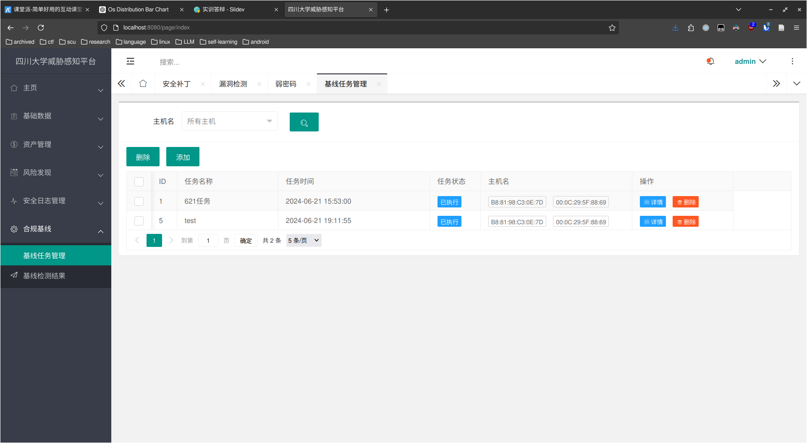

# 实训答辩

周俊宇 

2024年6月28日

---


## 修改密码

```javascript
var userPwd = data.field.userPwd;
            var userPwd2 = data.field.userPwd2;

            if (userPwd !== userPwd2) {
                layer.msg("两次密码输入不一致", {icon: 5});
                return false;
            }

            var userName = localStorage.getItem('username'); // 假设用户名存储在localStorage中

$.ajax({
                url: "/user/changePassword",
                type: "post",
                cache: false,
                contentType: "application/json;charset=utf-8",
                headers: {
                    'Authorization': localStorage.getItem('token')
                },
                data: JSON.stringify({
                    userName: userName,
                    userPwd: userPwd
                }),
```

---

后端：

```java
    @Override
    public ResponseResult changePassword(User user) {
        // 设置修改时间
        user.setUpdateTime(new Timestamp(System.currentTimeMillis()));
        // 处理密码
        user.setUserPwd(bCryptPasswordEncoder.encode(user.getUserPwd()));
        userMapper.updateByUserNameSelective(user);
        return new ResponseResult<>(0, "修改成功！");
    }
```

<v-click>


</v-click>

---

## 主页数据统计


--- 

## 基础数据


---


---

## 资产管理


---


---


---


---


---

## 风险发现


---


---


---

## 合规基线



---


---

## 登录token续期

在index.html引用一个自己写的js，检测用户活动以延长token有效期。

```javascript
function extendSession() {
    $.ajax({
        url: "/user/extendSession",
        type: "post",
        headers: {
            'Authorization': localStorage.getItem('token')
        },
        success: function(response) {
            console.log("Session extended");
        },
        error: function(response) {
            console.log("Error extending session: " + response);
        }
    });
}

$(document).on('click keydown', function() {
    extendSession();
});
```

--- 

后端代码：

```java
    @PostMapping("/user/extendSession")
    public ResponseResult extendSession(@RequestHeader("Authorization") String token) throws Exception {
        // 从token中解析出uuid
        String uuid = JwtUtil.parseJWT(token).getId();
        // 获取redis中的用户信息
        String redisKey = "login_" + uuid;
        String userJson = redisCache.getCacheObject(redisKey);
        if (userJson != null) {
            // 重新设置redis中用户信息的过期时间
            redisCache.setCacheObject(redisKey, userJson, 60 * 60, TimeUnit.SECONDS);
            return new ResponseResult(200, "Session extended successfully");
        } else {
            return new ResponseResult(1001, "Session not found");
        }
    }
```

---

效果：


---

## 权限管理

我的权限设计是基于角色的访问控制，方案如下：

- Admin 可以修改任意用户的角色，其他用户不能修改。
- Admin 可以编辑角色对资产信息的访问权限，其他用户不能修改。
- 只有“权限管理”页面的角色名中“是否允许查看资产信息”被赋值为“是”的角色，可以查看资产管理的页面。

在本例中，超级管理员和资产管理员可以查看资产信息，而admin是超级管理员，alice和tomcat是资产管理员，因此他们三个人可以查看资产信息：


---


---


---

后端实现：

```javascript
    @Override
    public ResponseResult list(MyParam param) {
        Authentication authentication = SecurityContextHolder.getContext().getAuthentication();
        if (authentication == null || !authentication.isAuthenticated()) {
            return new ResponseResult(1004, "User not authenticated");
        }
        String username = authentication.getName();

        Long roleId = (long) userMapper.selectUserRoleByUserName(username);
        int allowed = permissionMapper.selectPermissionByRoleId(roleId);
        if (allowed != 1) { // 不是超级管理员或资产管理员，则返回错误
            return new ResponseResult(1009, "用户没有权限");
        }

        // 做分页
        PageHelper.startPage(param.getPage(), param.getLimit());
        // 做查询
        List<Host> data = hostMapper.findAll(param);
        // 构建分页数据
        PageInfo<Host> pageInfo = new PageInfo<>(data);
        return new ResponseResult(pageInfo.getTotal(), pageInfo.getList());
    }
```

---

## 风险发现


---


---

## 安全日志


---


---


